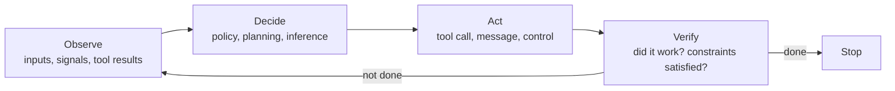
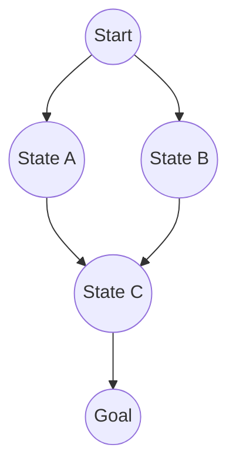
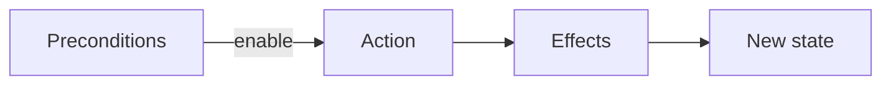
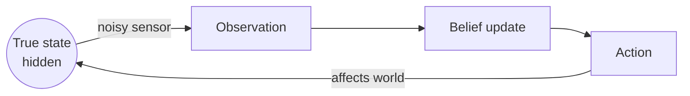
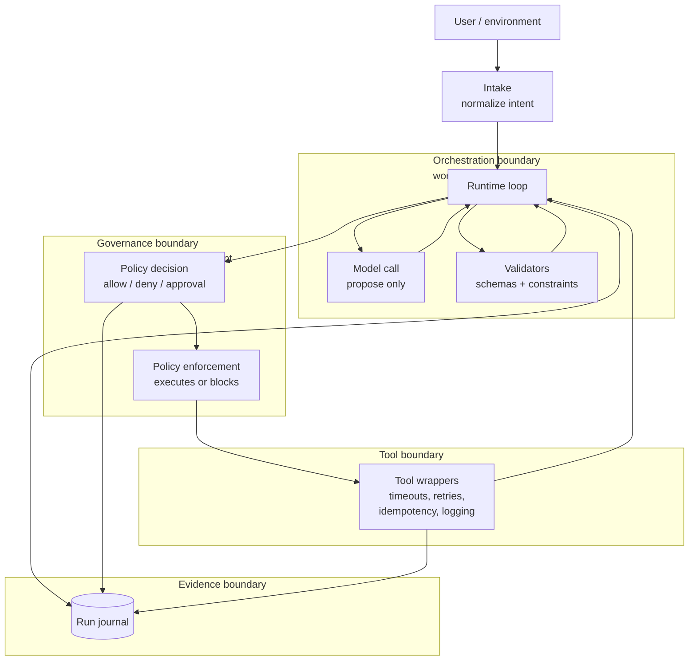
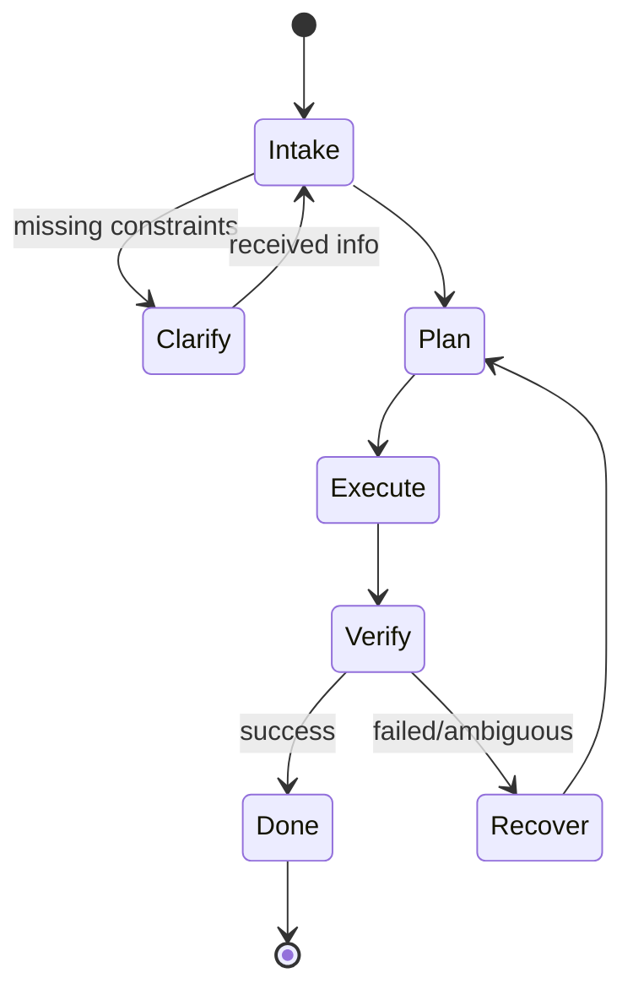
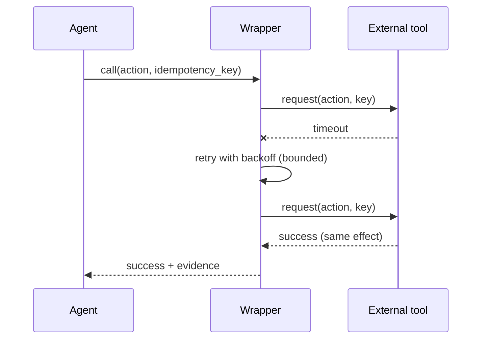
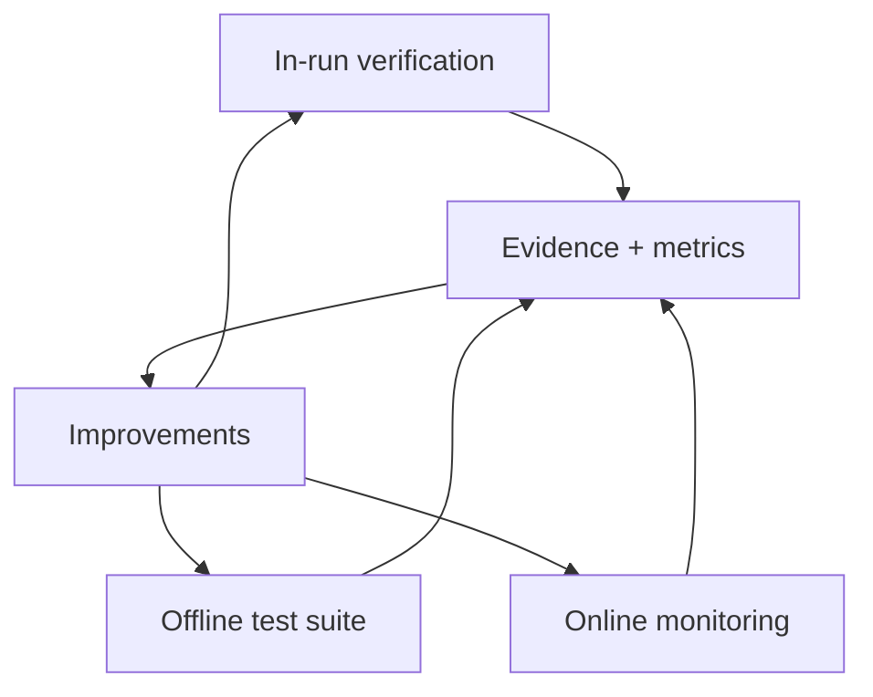
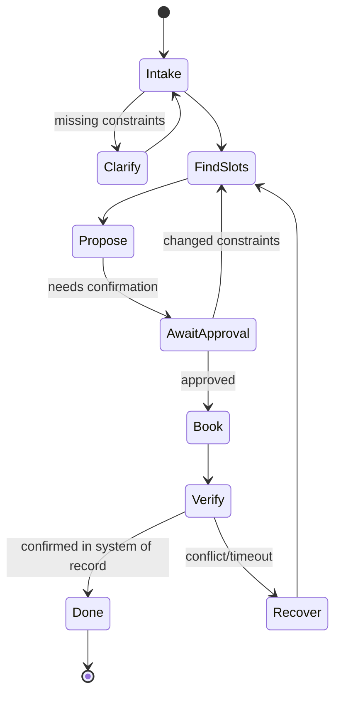

# Foundations of Artificial Intelligence through Agentic Systems  
### A concept-first, engineering-aware introduction for second-year undergraduates (February 2026 edition)

**Audience.** This text is written for students who can program confidently but are still building mathematical maturity. The presentation therefore privileges *precise concepts*, *executable mental models*, and *engineering reality* over heavy formalism. Where a topic normally involves substantial mathematics, the main text emphasizes intuition and discrete examples, with optional “math toolkits” in sidebars.

**Thesis.** The most durable way to understand AI in a period of rapid technological change is to treat AI as the study and construction of **agents**: systems that repeatedly **observe → decide → act → verify → stop**, under uncertainty and resource constraints. Models (including deep networks and modern generative models) are important components—but **agency is a system property**, not a model property.

---

## How to read this book

- If you are new to AI, read straight through Parts I–III in order.
- If you already know some ML, you can skim Chapters 5–6 and focus on Chapters 7–10 (agentic systems engineering).
- Each chapter ends with a **Mental Map** section: what to remember, and how the ideas connect.
- Mermaid diagrams are used as “whiteboard diagrams.” They are meant to be re-drawn and modified.

---

## Table of Contents

**Part I — AI as Agency (the timeless map)**  
1. Agents, Rationality, and Environments  
2. Problem Solving by Search  
3. Planning and Acting: From Sequences to Policies  

**Part II — Uncertainty and Learning (decision-making in the messy world)**  
4. Probability for Agents: Beliefs, Evidence, and Calibration  
5. Sequential Decision-Making: Utilities, MDPs, and POMDP Intuition  
6. Learning: Supervised Learning, Deep Learning Intuition, and Reinforcement Learning  

**Part III — Agentic Systems Engineering (turning decisions into reliable software)**  
7. The Big Map of Agentic Systems: Behavior + Reliability + Evaluation  
8. Behavior Engineering: Decomposition, Tool Use, Memory, Verification, Stopping  
9. Reliability Engineering: Workflows, Tool Contracts, Fault Tolerance, Security  
10. Evaluation Engineering: Specifications, Test Suites, Statistics, Monitoring  

**Part IV — Case Studies (end-to-end, real-world shaped)**  
11. A Meeting Scheduler Agent (medium risk)  
12. A Support Triage Agent (medium risk, high volume)  
13. A Purchase Agent (high risk)  

**Part V — Reference**  
14. Pattern Catalog (recipes you reuse forever)  
15. Glossary and Minimal Math Toolkit  

---

# Part I — AI as Agency (the timeless map)

## 1. Agents, Rationality, and Environments

### 1.1 What is an “agent”?

In the classical AI framing, an **agent** is a system that **perceives** its environment and **acts** upon that environment. The agent’s behavior is guided by objectives (goals, rewards, utilities), beliefs about the world, and available actions.

A compact definition used in many textbooks is:

> An agent implements a mapping from *percept history* to *actions*.

That definition is deliberately general. It covers a chess program, a robot vacuum, a trading algorithm, and a customer-support assistant.

#### The agent loop (the operational definition)

In practice, modern AI systems are best understood as the repeated execution of a loop:



**Why verification matters.** In toy settings, “act” is often the end. In real systems, actions can fail silently, return partial results, or produce side effects. Verification is what makes an agent *reliable* rather than *performative*.

---

### 1.2 Rationality and bounded rationality

An agent is often called **rational** if it chooses actions that maximize expected performance, given what it knows and what it can do. This is not the same as “always correct.” Rationality is about *best possible decision-making under the circumstances*.

Real agents are **boundedly rational**: they have limited computation time, limited memory, imperfect sensors, and incomplete models. Bounded rationality is not a weakness; it is the normal condition of intelligence in the physical world.

**Analogy.** A rational route planner does not compute *all* possible routes on Earth. It uses heuristics, time limits, and local approximations to produce a good route quickly. That is bounded rationality in action.

---

### 1.3 PEAS and environment types

A useful design tool is the **PEAS** description:

- **P**erformance measure: what counts as success?
- **E**nvironment: what world does the agent operate in?
- **A**ctuators: how can it act?
- **S**ensors: what can it observe?

Example: a meeting-scheduler agent  
- Performance: correct booking, no privacy leaks, minimal user effort, low latency  
- Environment: calendars, time zones, policies, human preferences  
- Actuators: read calendars, propose times, create events, send messages  
- Sensors: user text, calendar availability, tool results

AI behavior also depends strongly on environment properties:

- **Observable vs partially observable**: can the agent see the full state?
- **Deterministic vs stochastic**: do actions have predictable outcomes?
- **Episodic vs sequential**: are decisions independent, or do they affect the future?
- **Static vs dynamic**: does the world change while the agent deliberates?
- **Single-agent vs multi-agent**: are there other decision-makers?

These properties determine which tools (search, probability, learning, game theory) become necessary.

---

### 1.4 Goals, rewards, and utilities (three related but distinct ideas)

- A **goal** is a desired condition (e.g., “arrive at destination”).
- A **reward** is a scalar feedback signal, often used in reinforcement learning (e.g., +1 per correct step).
- A **utility** is a measure of preference across outcomes (e.g., “prefer cheap flights unless travel time exceeds 6 hours”).

In engineering, you often start with goals (“book a meeting”) and constraints (“do not invite anyone unapproved”), then gradually formalize them into a utility function or a multi-objective score.

**Important caution.** Objectives are never neutral. Defining “success” is where values and tradeoffs enter the system. This is one reason evaluation (Part III) is part of AI, not an afterthought.

---

### 1.5 Mental Map (Chapter 1)

- AI is most durably understood as **agency**: repeated decisions with actions and verification.
- Rationality is “best decision given knowledge and constraints,” not omniscience.
- **Environment properties** determine appropriate methods.
- Goals/rewards/utilities are different lenses on “what the agent wants.”

---

## 2. Problem Solving by Search

Many AI problems can be framed as: *find a sequence of actions that transforms an initial state into a goal state while minimizing cost*. This is the **search** view.

### 2.1 Problem formulation

A classical search problem is defined by:

- **State space**: all possible configurations of the world relevant to the task
- **Initial state**
- **Actions** (operators)
- **Transition model**: how actions change states
- **Goal test**
- **Path cost**

This formulation is timeless because it separates *problem definition* from *problem-solving method*.

**Analogy.** Solving a maze:  
- state = your position; action = move; transition = changes position; goal test = at exit; cost = steps.

---

### 2.2 Trees, graphs, and why repeated states matter

Search often explores a **tree of possibilities**, but many problems contain repeated states. Treating the structure as a **graph** (with a visited set) avoids exponential re-work.



In a tree view, `C` appears twice. In a graph view, it is a single node with multiple incoming edges.

---

### 2.3 Uninformed search: BFS, DFS, and uniform cost

- **Breadth-First Search (BFS)** explores by increasing depth. It is complete for finite branching and finds shortest paths when all edges have equal cost.
- **Depth-First Search (DFS)** explores deep first. It uses little memory but can get trapped in deep/irrelevant branches.
- **Uniform Cost Search (UCS)** explores by increasing path cost, guaranteeing optimality for nonnegative costs.

The key lesson is not memorizing algorithms; it is understanding *what resource they consume* (time vs memory) and *what guarantees they provide*.

---

### 2.4 Informed search: heuristics and A\*

A **heuristic** is a function \(h(n)\) estimating the remaining cost from a node \(n\) to the goal. Heuristics make search practical.

**A\*** uses:
\[
f(n) = g(n) + h(n)
\]
where \(g(n)\) is the cost so far and \(h(n)\) is the estimated remaining cost.

- If \(h\) is **admissible** (never overestimates), A\* is optimal.
- If \(h\) is also **consistent** (monotone), A\* has strong efficiency properties.

You can understand admissibility without calculus: the heuristic is an optimistic estimate.

**Example.** In a grid, Manhattan distance is admissible for 4-direction movement, because it never exceeds the true shortest path length.

---

### 2.5 Search in modern agentic systems

Modern agents often search in *abstract spaces*:

- **plan space**: possible step-by-step procedures
- **tool-call space**: which tool to call next with what arguments
- **hypothesis space**: which explanation best fits observations

Even when an LLM proposes a plan in natural language, the *system* can still implement structured search over plans, enforce constraints, and verify intermediate results.

**Practical perspective.** In many production systems, the most effective pattern is:
1) use a model to propose candidates,  
2) use search + rules + tools to validate and select.

---

### 2.6 Mental Map (Chapter 2)

- Search is a general method for producing action sequences under constraints.
- Heuristics are principled approximations that trade exactness for tractability.
- In agentic systems, search reappears as planning, tool routing, and hypothesis selection.

---

## 3. Planning and Acting: From Sequences to Policies

Search produces **plans**: sequences of actions. Real agents need more: they need **policies** that decide what to do in response to new information.

### 3.1 Plans vs policies

- A **plan** is a proposed sequence: \(a_1, a_2, \dots, a_k\).
- A **policy** is a mapping from state (or belief) to action: \(\pi(s) = a\).

Policies are more general because the world changes. When uncertainty is present, a fixed plan may fail; a policy can adapt.

**Analogy.** A cooking recipe is a plan. A skilled cook also has a policy: “if the sauce is too thick, add water.”

---

### 3.2 Classical planning in brief (the idea, not the entire field)

Classical planning often assumes:

- deterministic actions,
- full observability,
- discrete states.

A common representation is **STRIPS-like operators**: actions with preconditions and effects. Planning becomes a search in state space or plan space.



Even if you never implement STRIPS, the *conceptual separation* (preconditions/effects) is extremely useful for tool-using agents: tools have preconditions (required inputs, permissions) and effects (read/write, reversible/irreversible).

---

### 3.3 Reactive vs deliberative behavior

- **Reactive** systems respond immediately to stimuli (fast, robust, limited).
- **Deliberative** systems plan using internal models (flexible, compute-heavy).

Modern agentic systems often combine both:

- reactive guardrails (policy enforcement, schemas, risk checks),
- deliberative planning (task decomposition, option generation).

---

### 3.4 Stopping rules and the economics of computation

An agent must decide not only *what* to do, but *when to stop*. Stopping rules are part of rational action under resource constraints.

Examples:
- Stop when success criteria are verified.
- Stop when uncertainty is too high and the cost of being wrong is too high → ask a question or escalate.
- Stop when budgets (time, tool calls, money) are exceeded.

A system without explicit stopping rules will eventually “wander,” often expensively.

---

### 3.5 Mental Map (Chapter 3)

- Planning produces sequences; policies produce *adaptive behavior*.
- Preconditions/effects are a useful mental model for tool usage.
- Reactive constraints + deliberative search is a robust hybrid.
- Stopping is a design decision, not an afterthought.

---

# Part II — Uncertainty and Learning (decision-making in the messy world)

## 4. Probability for Agents: Beliefs, Evidence, and Calibration

Agents rarely observe the true state. They must act under uncertainty. Probability provides a disciplined language for uncertainty.

### 4.1 Probability as belief bookkeeping

In this book, probability is used primarily as:
- a way to represent uncertainty, and
- a way to update beliefs when new evidence arrives.

You do not need calculus for the main ideas.

Key objects:
- \(P(H)\): prior probability of hypothesis \(H\)
- \(P(E \mid H)\): likelihood of evidence \(E\) if \(H\) is true
- \(P(H \mid E)\): posterior probability after observing \(E\)

---

### 4.2 Bayes’ rule (the update operator)

Bayes’ rule is:
\[
P(H \mid E) = \frac{P(E \mid H) P(H)}{P(E)}
\]

Interpretation: **posterior ∝ likelihood × prior**.

**Example (discrete, intuitive).** Suppose an email-filtering agent detects a suspicious link (evidence). If phishing is rare (small prior), a single weak signal should not produce certainty. With multiple independent signals (strong likelihood), the posterior rises.

---

### 4.3 Conditional independence and why it matters

Many probabilistic updates rely on the idea that some pieces of evidence are (approximately) independent given a hypothesis.

This matters because it allows an agent to combine evidence without double-counting.

**Practical note.** In real systems, independence assumptions are often approximate. Evaluation (Chapter 10) is how you check whether your approximations remain safe.

---

### 4.4 Belief state and partial observability

When the agent cannot see the true state \(s\), it maintains a **belief state** \(b\): a distribution over possible states.



In tool-using software agents, “observations” include:
- user messages,
- retrieved documents,
- tool outputs (which may be incomplete or wrong).

A key engineering principle follows:

> Treat external inputs as **observations**, not as commands or truth.

This principle becomes central when dealing with adversarial inputs (prompt injection) and unreliable tools.

---

### 4.5 Calibration: knowing what you do not know

A system is **calibrated** if its confidence matches reality. For example, among events predicted with 70% confidence, about 70% should occur.

Calibration is part of rational action:
- overconfidence leads to unnecessary risky actions,
- underconfidence leads to excessive questioning and inefficiency.

Calibration is not achieved by optimism; it is achieved by **evaluation under representative conditions**.

---

### 4.6 Value of information (when to ask questions)

A powerful decision concept is the **value of information**:

- Asking a question has a cost (time, user effort).
- Acting without asking has an expected risk (errors, side effects).

An expert agent asks questions when the expected benefit of reducing uncertainty exceeds the cost.

This concept links probability to behavior design (Chapter 8): “clarify vs act” is not a stylistic choice; it is a decision under uncertainty.

---

### 4.7 Mental Map (Chapter 4)

- Probability is a disciplined representation of uncertainty.
- Bayes’ rule is the mechanism for updating beliefs.
- Belief states formalize partial observability.
- Calibration and value of information connect uncertainty to rational behavior.

---

## 5. Sequential Decision-Making: Utilities, MDPs, and POMDP Intuition

Many AI problems are not “one-shot.” Decisions affect future states. This leads to sequential decision-making.

### 5.1 Expected utility (the conceptual core)

If outcomes have utilities, rational choice under uncertainty often means maximizing **expected utility**:
\[
\mathbb{E}[U] = \sum_i P(\text{outcome}_i) \cdot U(\text{outcome}_i)
\]

In practice, systems often use multi-objective scores (success, safety, cost, latency) rather than a single number. The idea remains: decisions have tradeoffs.

---

### 5.2 Markov Decision Processes (MDPs) in intuition

An **MDP** models:
- states \(s\),
- actions \(a\),
- transition probabilities \(P(s' \mid s, a)\),
- rewards \(R(s, a)\),
- a discount factor \(\gamma\) for future rewards.

The Markov property means: the future depends on the present state, not on the full history (given the present).

**Why MDPs matter even if you never solve one exactly:**  
They clarify what it means to choose actions for long-term consequences.

---

### 5.3 Policies and value functions (in plain language)

A **policy** tells you what to do. A **value function** tells you how good a state (or action) is, in the long run.

- \(V^\pi(s)\): expected long-term reward starting from \(s\) under policy \(\pi\).
- \(Q^\pi(s,a)\): expected long-term reward taking action \(a\) in \(s\), then following \(\pi\).

These are the conceptual building blocks of reinforcement learning (Chapter 6).

---

### 5.4 Partial observability: POMDP intuition

A **POMDP** extends an MDP by acknowledging that the agent does not observe the state directly. It must act based on a belief state (Chapter 4).

This is the common situation in real-world agents:
- a medical agent does not fully observe a patient’s internal state,
- a customer-support agent does not fully observe the company’s backend,
- an operations agent does not fully observe the true cause of an outage.

The engineering implication: verification and safe stopping are essential.

---

### 5.5 Mental Map (Chapter 5)

- Sequential decision-making connects actions to future consequences.
- MDP concepts explain “long-term” vs “short-term” choices.
- Partial observability is normal; belief states and verification are the practical response.

---

## 6. Learning: Supervised Learning, Deep Learning Intuition, and Reinforcement Learning

Learning is a way to obtain or improve behavior from data. It is not the whole of AI, but it is a major component of modern systems.

### 6.1 Three learning regimes (what question are you answering?)

1. **Supervised learning**: learn \(x \to y\) from labeled examples.  
   *Question:* “Given this input, what label/value should I predict?”

2. **Unsupervised / self-supervised learning**: learn representations from unlabeled data.  
   *Question:* “What structure exists in the data?”

3. **Reinforcement learning (RL)**: learn a policy to maximize reward through interaction.  
   *Question:* “What actions should I take over time to do well?”

---

### 6.2 Generalization and dataset shift (the central difficulty)

The fundamental challenge of learning is **generalization**: performing well on new examples that were not seen during training.

Two common failure modes:
- **Overfitting**: learning patterns specific to training data rather than the underlying regularities.
- **Dataset shift**: the world changes (or differs from the training distribution).

In agentic systems, dataset shift is common because the environment is interactive and users adapt.

**Engineering consequence.** Offline evaluation must be complemented by online monitoring (Chapter 10).

---

### 6.3 Minimal supervised learning concepts for practitioners

Even without heavy math, you should understand:

- **Features / representations**: what information the model uses.
- **Loss function**: how errors are measured during training.
- **Train/validation/test split**: how to measure generalization.
- **Precision/recall** (for detection tasks): tradeoff between false positives and false negatives.

**Example (real-world).** Fraud detection:
- High recall catches more fraud but increases false alarms.
- High precision reduces false alarms but may miss fraud.
Which is better depends on the cost model (utilities).

---

### 6.4 Deep learning intuition: representation learning

Deep networks are powerful because they learn intermediate representations automatically. In modern generative models, these representations encode rich statistical structure of language, images, and other modalities.

**Crucial perspective for agent designers:**  
Even highly capable models can produce plausible text that is not grounded in reality. Therefore:
- use **tools** for facts,
- treat model outputs as proposals,
- verify claims when consequences matter.

---

### 6.5 Reinforcement learning (RL): learning policies

RL formalizes learning in sequential settings (Chapter 5). The agent explores, receives rewards, and updates behavior.

Concepts:
- **exploration vs exploitation**
- **credit assignment** (which action caused the eventual reward?)
- **model-free** methods (learn directly from experience)
- **model-based** methods (learn or use a model of the environment)

**Bridge to planning.** Planning can be seen as *search using a model*. Model-based RL can be seen as *learning a model, then planning with it*.

---

### 6.6 Learning inside agentic systems (a systems view)

In production, learning is embedded in a larger loop:
- data collection and governance,
- training,
- evaluation and gating,
- deployment,
- monitoring and drift detection,
- incident-driven improvements.

This is why “evaluation” and “reliability” are not separate from learning: they are how learning becomes a dependable capability rather than a source of unpredictable behavior.

---

### 6.7 Mental Map (Chapter 6)

- Learning is one way to obtain behavior; agency is the broader frame.
- Generalization is the central difficulty; shift is the default condition.
- Deep learning improves representations but does not replace verification.
- RL connects to planning and long-term decision-making.

---

# Part III — Agentic Systems Engineering (turning decisions into reliable software)

## 7. The Big Map of Agentic Systems: Behavior + Reliability + Evaluation

### 7.1 Definition and scope

An **agentic system** is software that can:
- interpret a goal,
- decide steps,
- call tools / take actions,
- track state over time,
- verify progress,
- and stop.

A modern model (including a generative model) is typically a *component* that proposes plans, drafts, or structured actions. The *system* is responsible for enforcing constraints, handling failures, and producing evidence.

---

### 7.2 The three pillars

A dependable agentic system combines three pillars:

1. **Behavior** (the “brain”): how the agent decides what to do next.  
2. **Reliability** (the “body”): how actions execute safely and repeatably under real-world failures.  
3. **Evaluation** (the “nervous system”): how you specify “good,” test it, and keep it good over time.

```mermaid
flowchart TB
  subgraph Behavior["Behavior: decision-making"]
    B1[Task decomposition]
    B2[Tool selection and routing]
    B3[Clarify vs act]
    B4[Memory strategy]
    B5[Verification strategy]
    B6[Stopping rules]
  end

  subgraph Reliability["Reliability: execution guarantees"]
    R1[Workflow control (state machines)]
    R2[Tool contracts and wrappers]
    R3[Fault tolerance and recovery]
    R4[Observability (logs/metrics/traces)]
    R5[Security boundaries (least privilege)]
    R6[Concurrency control]
  end

  subgraph Evaluation["Evaluation: measurement and improvement"]
    E1[Specifications and constraints]
    E2[Test suites (typical + edge + adversarial)]
    E3[Scoring (rules + humans + calibrated judges)]
    E4[Regression gates]
    E5[Online monitoring (SLIs/SLOs)]
  end

  Behavior --> Reliability
  Reliability --> Behavior
  Behavior --> Evaluation
  Reliability --> Evaluation
  Evaluation --> Behavior
  Evaluation --> Reliability
```

---

### 7.3 The six canonical objects (for auditable systems)

Well-designed agentic systems make six objects explicit:

| Object | Meaning | Why it matters |
|---|---|---|
| **Intent** | desired outcome (not steps) | makes evaluation possible |
| **State** | current beliefs and progress | enables resumability and debugging |
| **Plan** | structured proposal of steps | supports verification and control |
| **Action** | typed tool call with effect class | prevents “free-text side effects” |
| **Observation** | external input treated as untrusted | prevents injection and tool errors from becoming “truth” |
| **Evidence** | logs, validations, policy decisions, evaluations | supports audit and improvement |

A useful rule:
> The model can propose plans; the system must control actions and evidence.

---

### 7.4 Non-negotiable invariants (demo vs system)

A production-grade agentic system enforces:
1. **Boundedness**: explicit budgets (time, steps, tool calls, money).  
2. **Mediation**: side effects only occur through enforceable paths.  
3. **Effect typing**: actions are classified by risk and impact.  
4. **Reproducibility**: runs are replayable with recorded evidence.  
5. **Trust discipline**: external inputs are untrusted by default.  
6. **Measurability**: success is defined by specs, tests, and metrics.  
7. **Operability**: safe mode, rollback, and runbooks exist.

These invariants are not specific to any framework. They are consequences of building systems that act in the world.

---

### 7.5 Architecture boundaries (control and trust)

A durable mantra:
> **The model proposes; the system disposes.**

The model is not a security boundary, not a policy engine, and not an execution boundary. Deterministic software must enforce those roles.



---

### 7.6 Mental Map (Chapter 7)

- Agentic systems require **behavior**, **reliability**, and **evaluation**.
- Make intent/state/plan/action/observation/evidence explicit.
- Enforce invariants and boundaries; do not delegate governance to the model.

---

## 8. Behavior Engineering: Decomposition, Tool Use, Memory, Verification, Stopping

Behavior engineering turns “a model that can talk” into “a system that can decide responsibly.”

### 8.1 Task decomposition: from vague goals to checkable subgoals

A decomposition is good if:
- each subgoal is **verifiable**,
- inputs are explicit,
- and the next step is unambiguous.

Example (flight booking):
1) collect constraints,  
2) search,  
3) shortlist with tradeoffs,  
4) confirm choice,  
5) purchase,  
6) verify receipt,  
7) summarize itinerary.

---

### 8.2 Clarify vs act (decision under uncertainty)

A practical decision rule:

- Ask a question when ambiguity is high *and* the cost of a mistake is high (especially for irreversible actions).
- Otherwise, prefer a low-risk information-gathering action (often a read-only tool call), or present options.

This rule operationalizes “value of information” (Chapter 4).

---

### 8.3 Tool routing: tools for facts, models for transformation

A durable routing principle:
- Use tools (databases, APIs, web, code execution) to obtain **facts** and **state of record**.
- Use models to perform **transformations**: summarization, ranking, drafting, restructuring.

Treat tool outputs as observations:
- they may be incomplete,
- they may be stale,
- they may be adversarially poisoned.

Therefore verification is essential.

---

### 8.4 Verification strategies

Verification can be:
1. **State-of-record verification**: re-query the authoritative system.  
2. **Constraint verification**: check against requirements.  
3. **Sanity verification**: detect impossible outputs.

**Example.** After creating a calendar event:
- fetch the event to confirm it exists,
- validate time zone and attendees,
- ensure no prohibited attendees were added.

---

### 8.5 Memory design and hygiene

Memory should store:
- stable user preferences,
- confirmed facts,
- provenance (where the fact came from and when).

Avoid storing:
- unverified model outputs,
- ephemeral details that may change,
- sensitive data without a governance plan.

A useful separation:
- **working memory** (per run),
- **long-term memory** (across runs),
- **source of truth** systems (authoritative tools).

---

### 8.6 Stopping rules (prevent wandering)

Stopping conditions should be explicit and enforceable:
- verified success,
- user requested stop,
- budget exceeded,
- risk threshold reached → safe stop or escalation.

---

### 8.7 Multi-agent patterns (use sparingly)

Multiple specialized agents can help with parallel research or adversarial review, but they multiply coordination and evaluation complexity. A robust default is:

- parallelize read-only operations,
- centralize decisions,
- serialize side-effecting writes.

---

### 8.8 Mental Map (Chapter 8)

- Behavior is a policy over the observe–decide–act–verify–stop loop.
- Decomposition, routing, verification, memory hygiene, and stopping rules are core.
- Treat external text as data, not commands.

---

## 9. Reliability Engineering: Workflows, Tool Contracts, Fault Tolerance, Security

Reliability engineering makes behavior repeatable under failure.

### 9.1 Workflows as state machines

State machines make control explicit and resumable.



State machines improve:
- boundedness (cap transitions),
- debugging (you know where you are),
- resumability (continue after interruption),
- auditability (explicit decisions).

---

### 9.2 Tool contracts and wrappers (where reliability actually lives)

A tool wrapper enforces:
- schemas (fail closed),
- timeouts,
- retries with backoff,
- circuit breakers,
- idempotency for side effects,
- authentication and least privilege,
- logging/tracing with redaction.

#### Idempotency (the “do not duplicate side effects” principle)

If a network timeout occurs, you may not know whether a request succeeded. Retrying without idempotency can cause double booking, double payment, or duplicate messages.



---

### 9.3 Concurrency control: parallel reads, serialized writes

Concurrency improves throughput but increases risk of races and duplicates. A stable pattern:
- **parallelize reads**,
- **serialize writes** through a single-writer commit path.

---

### 9.4 Fault tolerance and recovery ladders

A designed recovery ladder:
1) retry safely (bounded, idempotent),  
2) fallback tool,  
3) ask the user,  
4) escalate to a human,  
5) safe stop with evidence.

A critical principle:
> Retry is not repair. Repair requires changing something (inputs, tool choice, plan), not repeating the same action indefinitely.

---

### 9.5 Observability and run journals (the “black box recorder”)

A **run journal** records:
- state transitions,
- tool calls and results,
- policy decisions,
- validations and outcomes,
- versions/hashes of configuration.

This turns incidents into reproducible debugging tasks rather than folklore.

---

### 9.6 Security boundaries (the model is not a security boundary)

Threats include:
- prompt injection (direct and indirect),
- data exfiltration,
- confused deputy attacks (misuse of permissions),
- malicious tool outputs.

Controls that belong outside the model:
- allowlists for tools and actions,
- least-privilege authentication scopes,
- approval gates for irreversible actions,
- deterministic policy enforcement.

---

### 9.7 Privacy and governance (logging is powerful and dangerous)

Reliability often depends on logging; privacy depends on minimizing and governing stored data. Therefore:
- redact sensitive fields,
- define retention windows,
- restrict access to traces and memory,
- store references/hashes where possible.

---

### 9.8 Mental Map (Chapter 9)

- Reliability is workflow control + tool wrappers + observability + security boundaries.
- State machines and idempotency are foundational.
- Evidence and governance make systems operable and accountable.

---

## 10. Evaluation Engineering: Specifications, Test Suites, Statistics, Monitoring

Evaluation answers: “Is it good?” and “Did it get worse?” It is the scientific method applied to AI systems.

### 10.1 Specifications: define success and constraints

A useful specification includes:
- success criteria (what must be true),
- constraints (what must not happen),
- budgets (time/cost/steps),
- acceptable uncertainty (when to ask vs act).

Without a specification, improvement claims are indistinguishable from optimism.

---

### 10.2 Three evaluation modes

1) **In-run verification**: checks inside the workflow.  
2) **Offline evaluation**: fixed suites for regression testing.  
3) **Online monitoring**: metrics in production for drift and incidents.



---

### 10.3 Scoring: rules, humans, calibrated model-judges

- Use **rule checks** for objective properties (schemas, constraints).
- Use **human review** for subjective qualities (helpfulness, tone).
- Use **model-judges** only when calibrated against human judgments, and treat them as approximate.

---

### 10.4 Basic statistical hygiene for stochastic systems

Agent runs are stochastic; evaluation must account for variance.

Minimum practices:
- repeated trials,
- confidence intervals or uncertainty summaries,
- reporting tail risks for safety violations,
- paired comparisons under matched budgets.

A useful rule of thumb (informal): observing zero violations in \(N\) independent trials does not prove impossibility; it bounds the rate. This motivates large and adversarial test suites for safety-critical constraints.

---

### 10.5 Regression gates and release discipline

A mature system blocks deployments that:
- violate hard invariants,
- regress key metrics beyond thresholds.

This is how AI becomes engineering rather than performance art.

---

### 10.6 Adversarial evaluation (security as a test suite)

If your system interacts with untrusted text (users, web, tool outputs), adversarial tests should include:
- injection attempts,
- tool output poisoning,
- permission escalation probes,
- malformed arguments and schema fuzzing.

---

### 10.7 Online monitoring (SLIs/SLOs)

Common agent SLIs:
- task success rate,
- safety violation rate,
- tool error rate,
- escalation rate,
- cost per task,
- stuck-run rate,
- latency percentiles.

SLOs turn these into operational targets.

---

### 10.8 Mental Map (Chapter 10)

- Evaluation operationalizes the scientific method.
- Specifications define what “good” means.
- Offline/online/in-run evaluation form a continuous loop.
- Statistics and adversarial tests prevent self-deception.

---

# Part IV — Case Studies (end-to-end, real-world shaped)

## 11. A Meeting Scheduler Agent (medium risk)

### 11.1 Problem framing (PEAS)

- Performance: correct time zone, no conflicts, minimal back-and-forth, privacy preserved.  
- Environment: calendars, time zones, user preferences, organizational policies.  
- Actuators: read availability, propose times, create event, send invitations.  
- Sensors: user messages, calendar tool outputs, policy tool outputs.

### 11.2 Workflow (state machine)



### 11.3 Common failure modes and mitigations

- Time zone mistakes → explicit normalization + verification  
- Double booking → idempotency + re-check conflicts  
- Privacy leakage → policy enforcement + redaction  
- Tool outages → bounded retries + fallback + safe stop

### 11.4 Mental Map (Case Study)

The case illustrates the book’s core idea: the agent’s intelligence is as much in its *workflow and verification* as in its model.

---

## 12. A Support Triage Agent (medium risk, high volume)

### 12.1 Objectives

- Correct routing and priority assignment  
- Helpful, policy-consistent drafts  
- Minimal privacy risk  
- Robustness to malicious or confused user input

### 12.2 Why this is an excellent “first real agent”

Support triage exposes:
- uncertainty (missing information),
- tool integration (ticket systems, knowledge bases),
- evaluation design (labels and rubrics),
- scale considerations (cost and latency).

### 12.3 Mental Map (Case Study)

This case demonstrates that *evaluation and governance* are central: routing mistakes can be expensive even if the language is fluent.

---

## 13. A Purchase Agent (high risk)

### 13.1 Why high risk?

Purchase is a side-effecting domain with:
- irreversible actions (payments),
- fraud and adversarial behavior,
- strong preference sensitivity,
- high consequences for errors.

### 13.2 The core safety design

- Risk tiers: read-only → reversible writes → irreversible writes  
- Human approval for irreversible actions  
- Idempotency for payment  
- Verification with system of record (receipt)

### 13.3 Mental Map (Case Study)

This case shows the strongest form of “model proposes; system disposes”: the model helps with options and explanations, but governance controls the action boundary.

---

# Part V — Reference

## 14. Pattern Catalog (recipes you reuse forever)

### 14.1 Risk tiers for actions

- **Tier 0:** read-only  
- **Tier 1:** reversible writes (drafts, tentative objects)  
- **Tier 2:** irreversible writes (send, pay, delete)

Policy: Tier 2 requires approval + idempotency + verification.

---

### 14.2 “Verification is a state” pattern

Do not bury verification in prose. Make it a workflow state:
- Execute → Verify → Recover/Done.

---

### 14.3 “Assumption ledger” pattern

Track assumptions with validation and expiry:
- what you assume,
- how you validated it,
- when to re-check.

This is how teams avoid building on silently rotting assumptions.

---

### 14.4 “Parallel reads, serialized writes” pattern

Maximize speed without duplicates:
- parallelize safe read operations,
- serialize side effects through one commit path.

---

### 14.5 “Safe degradation” pattern

Operational modes:
- NORMAL → RESTRICTED (read-only) → SAFE_HOLD (stop automation, escalate)

Triggers:
- tool instability,
- anomaly spikes,
- security signals.

---

## 15. Glossary and Minimal Math Toolkit

### 15.1 Glossary (selected)

- **Agent:** system that perceives and acts to achieve objectives.  
- **Policy (\(\pi\))**: mapping from state/belief to action.  
- **State machine:** explicit workflow with states and transitions.  
- **Idempotency:** repeating a request does not repeat its side effect.  
- **SLI/SLO:** metric / target for operational quality.  
- **Prompt injection:** malicious content that attempts to control the agent by smuggling instructions.  
- **Confused deputy:** system misuses its authority due to attacker manipulation.  
- **Belief state:** distribution over possible states under partial observability.  

### 15.2 Minimal probability toolkit (discrete)

- Conditional probability: \(P(A\mid B)\)  
- Bayes: \(P(H\mid E) \propto P(E\mid H)P(H)\)  
- Expected value: \(\mathbb{E}[X]=\sum_x xP(X=x)\)

### 15.3 Minimal learning toolkit

- Train/validation/test split  
- Overfitting and dataset shift  
- Precision/recall (for detection)  
- Offline vs online evaluation  

---

## Concluding synthesis

The AI landscape changes quickly. The underlying disciplines change slowly.

If you remember one mental model, remember this:

> **AI systems are agent loops.**  
> **Models propose; systems enforce.**  
> **Behavior makes them useful, reliability makes them safe, evaluation makes improvement real.**

---

### Suggested further reading (non-exhaustive)

- Russell & Norvig, *Artificial Intelligence: A Modern Approach* (agents, search, planning, uncertainty)  
- Sutton & Barto, *Reinforcement Learning* (MDPs, policies, value functions)  
- Standard texts in distributed systems and reliability engineering (timeouts, retries, idempotency, observability)
