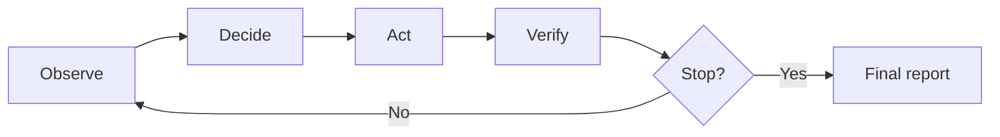

# Chapter 1 — Agents, Evidence, and Budgets

## 1.1 Definitions (minimal but precise)

An **agent** is a system that repeatedly:
1. **observes** its environment,
2. **decides** what to do next,
3. **acts** (sometimes with side effects),
4. **verifies** outcomes, and
5. **stops** according to explicit rules.

An **observation** is information the agent reads (metrics, logs, health checks).  
An **action** is something the agent attempts (restart, rollback, ask a human).  
**State** is the agent’s internal memory (what it has seen, what it has tried, what budget remains).  
**Evidence** is information that can be checked later to justify the agent’s decisions (a journal is evidence, not a feeling).  
A **budget** is a stop rule limiting resource usage (steps, tool calls, side effects).

### Analogy: a careful scientist in a noisy lab

Observations are like measurements: they can be delayed, noisy, or misleading.  
A budget is like a time or reagent limit: it prevents endless fiddling.

## 1.2 The agent loop (the spine of the course)



This course makes **evidence** and **stop rules** first-class. Without them, an “agent” is usually a demo that cannot be trusted.

## 1.3 Run journals (why “it worked once” is not evidence)

A run journal is an **append-only** log of what the agent saw and did.

In this repository, the journal format is **JSONL**:
- one JSON object per line
- stable event IDs
- deterministic output under a seed

### What should be logged?

At minimum:
- the step number
- the action chosen
- each tool call and its output (or error)
- any validation/policy decisions
- verification evidence after side effects
- a final summary with evidence references

## 1.4 Worked example (excerpt)

Below is an illustrative excerpt from a journal (simplified):

```json
{"event_id":"a1b2c3d4e5f6","step_id":1,"kind":"step_start","payload":{"tool_calls":0,"side_effect_actions":0}}
{"event_id":"0aa9ff12cc34","step_id":1,"kind":"observation","payload":{"observation":{"tool":"get_metrics","service":"api","error_rate":0.34,"latency_ms":215.0}}}
{"event_id":"19de8833ab10","step_id":2,"kind":"action","payload":{"action":{"type":"ACT_ROLLBACK","service":"api","version":"v1"}}}
{"event_id":"8c0b7b1f2d9a","step_id":2,"kind":"verify","payload":{"observation":{"tool":"health_check","service":"api","status":"ok"}}}
{"event_id":"f00dbabe1234","step_id":2,"kind":"final","payload":{"summary":"Recovered and verified.","evidence_refs":["0aa9ff12cc34","8c0b7b1f2d9a"]}}
```

Key idea: the final line references earlier **evidence event IDs**.

## 1.5 Exercises

1. Explain the difference between *observation* and *state* in one paragraph.
2. Describe two different budgets and what failure mode each budget prevents.
3. Run `scripts/run_scenario.py --seed 0 --profile week1` and inspect the journal.
