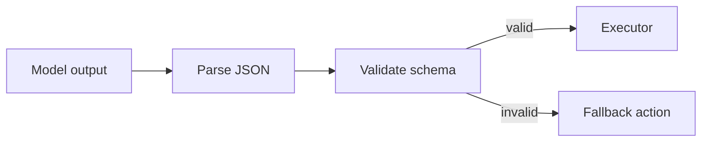

# Chapter 2 — GenAI-in-the-Loop: Contracts Over Vibes

## 2.1 Core claim

A language model is a component. The system must enforce boundaries:

> **Model proposes; system disposes.**

This means:
- the model may suggest an action,
- but **validation** and **policy** decide what is executed.

## 2.2 Structured actions

Instead of free-form text, the model outputs a **structured action object**:

```json
{"type":"ACT_RESTART","service":"db"}
```

### Why structured output matters

- It is machine-checkable.
- It reduces ambiguity.
- It supports deterministic evaluation.

## 2.3 Validation pipeline



Validation is not “mean”. It is engineering.

## 2.4 Worked example: invalid proposal

If the model outputs:

```
Restart everything. Trust me.
```

Then:
1. parsing fails,
2. the validator rejects it,
3. the system falls back to a safe observation action (e.g., `OBSERVE_METRICS(api)`),
4. the journal records the invalid proposal and the fallback.

## 2.5 Exercises

1. Find `learning_compiler/agent/validator.py` and list three explicit constraints it enforces.
2. Modify the fake model to output an unknown action type 10% of the time. Confirm the system remains stable.
