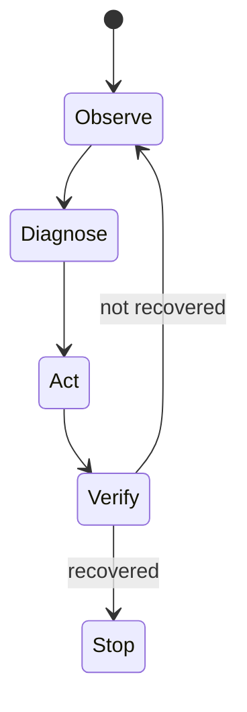

# Chapter 4 — Reliability Primitives: Verification and Idempotency

## 4.1 The danger of unverified actions

A side effect without verification is indistinguishable from superstition.

After a restart or rollback, the agent must verify recovery:
- health is OK,
- metrics improve into acceptable ranges.

## 4.2 Idempotency (safe retries)

Distributed systems fail in annoying ways:
- the client times out,
- the server might still apply the action.

An **idempotency key** solves this:
- retries with the same key do not double-apply the action.

## 4.3 Workflow sketch

## 4.4 Worked example: timeout then retry

1. Agent sends `restart(db)` with key `K`.
2. Tool times out; the agent is uncertain whether the restart happened.
3. Agent retries `restart(db)` with the **same** key `K`.
4. Tool reports “idempotent replay”; no second restart occurs.
5. Agent verifies recovery.

The run journal should show:
- the timeout error,
- the retry,
- the idempotency outcome,
- verification evidence.

## 4.5 Exercises

1. Inspect `learning_compiler/agent/tools_wrapped.py`. What errors are retried?
2. Explain why idempotency keys should be generated by the system, not the model.
