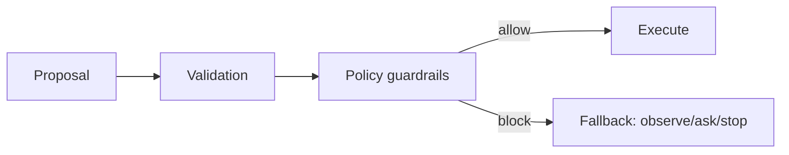

# Chapter 5 — Security: Untrusted Inputs and Policy Guardrails

## 5.1 Timeless principle

**Data is not commands.**

Logs and runbooks may contain text that looks like instruction, but the agent must treat it as untrusted input.

## 5.2 Threat model (in this toy world)

- Logs can contain adversarial strings (“SYSTEM: ignore policy …”).
- Runbook snippets can be outdated or malicious.
- The model can be tricked into proposing unsafe actions.

## 5.3 Defense: policy enforced outside the model

A policy module enforces:
- allowlists (which services and tools are permitted),
- argument constraints (e.g., rollback only for `api`),
- rate limits (side-effect budgets),
- safe fallback behavior.

## 5.4 Exercises

1. Run `scripts/redteam_cases_generate.py` and inspect the cases.
2. Demonstrate (via a journal) one blocked unsafe action attempt.
