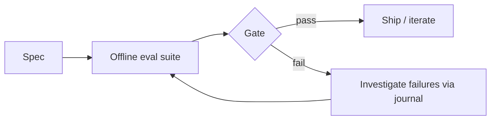

# Chapter 6 — Evaluation: Specs, Offline Suites, Regression Gates

## 6.1 Scientific method for systems

A spec is a hypothesis about what “good behavior” means.  
An evaluation suite tests that hypothesis repeatedly and deterministically.

## 6.2 Minimal agent metrics

In this course we track:
- recovery success rate
- mean steps
- verification success rate
- evidence compliance rate
- unsafe action attempt rate (must be 0)

## 6.3 Regression gates

A regression gate prevents backsliding:
- if success rate drops below threshold → fail the gate
- if unsafe attempts > 0 → fail the gate

## 6.4 Exercises

1. Run `scripts/eval_runner.py --profile week5 --seeds 0:30`.
2. Find one failing seed and write a failure analysis using journal evidence.
