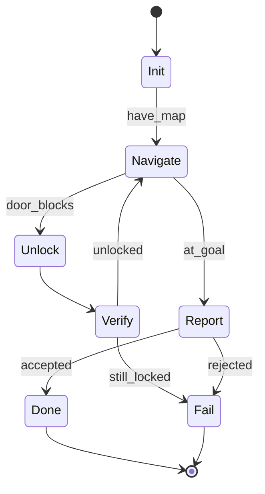

# Meeting 5 — Reliability Upgrade (Software That Won’t Betray You)

## Central question

How do we stop an agent from becoming an expensive ghost story?

This meeting adds reliability primitives that outlive any particular AI framework.

---

## Glossary (minimal)

- **Validation:** check tool outputs against a schema/contract.
- **Timeout:** stop waiting for a tool call (simulated here).
- **Retry:** attempt again (bounded, with explicit limits).
- **Idempotency:** repeated requests do not duplicate side effects.
- **State machine:** explicit workflow with named phases and transitions.
- **Replayability:** ability to reproduce and debug via a run journal.

---

## Reliability primitives (demonstrated in code)

1. **Validation**: `learning_compiler/tools/validator.py`  
2. **Timeouts + retries**: `learning_compiler/tools/wrappers.py`  
3. **Idempotency**: enforced via idempotency keys (system-generated)  
4. **Run journal**: `learning_compiler/journal/`  

The agent is refactored into an explicit workflow:

- `learning_compiler/agent/workflow.py`

---

## Analogy

Reliability is the difference between:
- “it usually works on my laptop,” and
- “it works when the network is on fire and a tool returns garbage.”

---

## Exercise

1. Run `python scripts/run_lab5.py --seed 1`.
2. Inspect the journal:
   - find a tool call with `attempts > 1`
   - find a tool call with a validation failure (if any)
3. Explain how the system prevents “double reporting” delivery.
