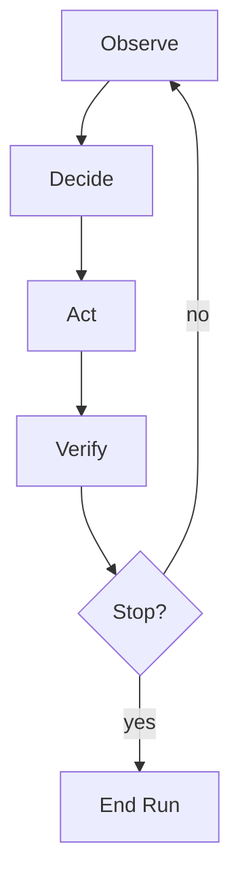

# Meeting 1 — The Big Map: What “AI” actually is (Agentic Systems anatomy)

## Learning objectives

By the end of this meeting you should be able to:

- Explain the **agent perspective** (Russell/Norvig): AI as goal‑directed behavior.
- Name and use the three pillars of an agentic system: **behavior, reliability, evaluation**.
- Identify the six canonical objects that make agents debuggable:
  **Intent, State, Plan, Action, Observation, Evidence**.
- Explain why budgets, stop rules, mediation of side effects, and reproducibility are “adult invariants.”

## The agent perspective (classical AI, still useful)

**Definition (Agent).**  
An *agent* is a system that maps its history of observations (“percepts”) to actions.

This definition is intentionally broad. A thermostat is an agent. A chess engine is an agent.
A self‑driving car is an agent. The interesting differences are in **goals, constraints,
uncertainty, and side effects**.

**Definition (Rationality).**  
An agent is *rational* if it chooses actions that maximize expected achievement of its goals,
given what it knows and what it wants, within its constraints.

This is not “perfect” or “optimal in every universe.” It is **bounded rationality**:
doing the right thing given limited compute, limited time, and limited information.

## The agent loop as an engineering object

Most confusion about AI disappears if you draw the loop.

The loop is the system. The “model” (if present) sits somewhere inside **Decide**.

### Why “verify” is a separate step

In toy demos, people often skip verification: they do something and assume it worked.
In production, verification is a non‑optional discipline:

- Did the tool action actually happen?
- Did it have the intended effect?
- Did we violate any constraints (budgets, permissions, policies)?

Verification produces **evidence**, which becomes the system’s memory of what occurred.

## The three pillars: Behavior, Reliability, Evaluation

### Behavior
Behavior is the decision mechanism.

Examples:
- search/planning algorithms (BFS, A*, etc.),
- hand‑coded policies (“if condition then act”),
- learned policies (supervised learning, reinforcement learning),
- hybrid methods (model proposes steps; planner checks them).

### Reliability
Reliability is the set of engineering mechanisms that make the loop dependable under real conditions:

- timeouts,
- retries with backoff,
- idempotency (“don’t double charge”),
- circuit breakers and safe degradation,
- concurrency rules (parallelize reads, serialize writes),
- security policies enforced outside the model.

Reliability is not “ops stuff.” It is part of AI systems because AI systems increasingly **act**.

### Evaluation
Evaluation is how you stay honest:

- define what “good” means (specification),
- measure it consistently,
- detect regressions,
- monitor performance in the wild,
- test adversarial cases (e.g., prompt injection attempts).

Evaluation is the scientific method, embedded in software.

## The six canonical objects (make the system debuggable)

These objects are “boring on purpose.” They prevent your system from becoming folklore.

### 1) Intent
**Intent** states what the agent is trying to achieve, and under what constraints.

Typical fields:
- goal (“reach the destination”),
- budgets (“max 20 steps”, “max 1 write action”),
- safety constraints (“never delete data”).

### 2) State
**State** is the internal information the agent uses to decide.

State may include:
- the agent’s current position (in a grid),
- the current hypothesis distribution (belief state),
- tool results already seen,
- a partial plan under construction.

State is not necessarily the full truth about the world; it may be incomplete.

### 3) Plan
A **plan** is a proposed sequence of actions.

Plans are common when:
- the world is relatively clean (games, puzzles, deterministic domains),
- the goal is clear and checkable,
- actions are reversible or cheap.

### 4) Action
An **action** is an effectful operation the system might take.

**Important: actions should be typed.**  
A safe system distinguishes at minimum:
- **READ** actions (observe, query, retrieve),
- **WRITE** actions (cause side effects),
- **COMPUTE** actions (pure calculation).

Typing actions lets you enforce budgets and policies.

### 5) Observation
An **observation** is a piece of incoming information.

Key principle:
> Observations are data, not truth by default.

Tool output is an observation.
Retrieved text is an observation.
User messages are observations.

### 6) Evidence
**Evidence** is verification output: artifacts that justify claims that the system did something correctly.

Examples:
- a receipt ID from a payment processor,
- a database transaction ID,
- a hash of a saved file,
- a check that a plan actually reached the goal.

Evidence is the antidote to “the model said it worked.”

## Adult invariants (non‑negotiables)

The following invariants separate demos from systems:

1. **Budgets and stop rules** are explicit.  
   “Stop when done” is not a feeling.

2. **Side effects are mediated** and typed.  
   The model proposes; the system disposes.

3. **Reproducibility is built in.**  
   Use seeded randomness and stable traces.

4. **Trust discipline is enforced.**  
   Tool output is not automatically trusted; it is observed and verified.

5. **Measurability exists from day one.**  
   If you cannot measure “good,” you cannot improve.

## Worked example (conceptual)

Consider a counter that must reach a target number.

- Intent: “reach target = 5 with max 20 steps”
- State: current value
- Action: increment or decrement by 1 (compute‑only)
- Observation: “counter=3”
- Evidence: “goal reached” if counter equals target

This is tiny, but it already includes the full loop. The same anatomy scales up.

## Real‑world example (why the 2026 world cares)

A customer support agent with tool access:

- Observes: user complaint, account info retrieved from tools.
- Decides: choose an action (refund, replacement, escalation).
- Acts: issues a refund (WRITE side effect).
- Verifies: checks refund transaction ID (evidence).
- Stops: ends interaction, or asks a clarifying question.

Without budgets, mediation, and verification, autonomy becomes a haunted house with a credit card.

---

Next: **Meeting 2 — Search & Planning: decision as structured computation**.
