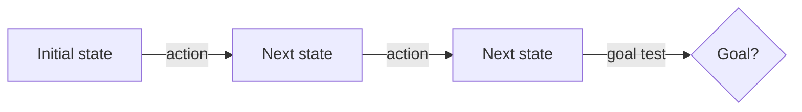

# Meeting 2 — Behavior I: Search & Planning (how agents decide in clean worlds)

## Learning objectives

By the end of this meeting you should be able to:

- Formulate a problem as a **state space** with actions, transitions, goals, and costs.
- Explain and implement BFS/DFS/UCS and A* in a small domain.
- Distinguish **plans** from **policies**.
- Explain what a **heuristic** is and why it can be a “useful lie with guarantees.”
- State an explicit **stopping rule** for a planning process.

## Problem formulation (the classical template)

A planning/search problem can be described by:

- **State space**: the set of possible states \(S\).
- **Initial state**: \(s_0\).
- **Actions**: what you can do in a state.
- **Transition model**: how actions change state.
- **Goal test**: how you recognize success.
- **Path cost**: how expensive a sequence of actions is.

This is not “old AI.” This is the most reusable interface in the entire field.

### A minimal diagram

## Core algorithms (math-light intuition)

### Breadth-First Search (BFS)
BFS explores the state space in layers:
- first all states at depth 1,
- then depth 2,
- etc.

**Guarantee:** If all actions have equal cost, BFS finds a shortest‑number‑of‑steps solution.

### Depth-First Search (DFS)
DFS explores one branch deeply before backtracking.

**Pros:** low memory usage.  
**Cons:** may get stuck exploring a very deep or infinite branch; not optimal.

DFS is a good example of why **stopping rules** matter (depth limits, timeouts).

### Uniform Cost Search (UCS)
UCS is like BFS, but by path cost rather than depth.

**Guarantee:** With non‑negative step costs, UCS finds an optimal solution.

### A* search
A* uses:
- \(g(n)\): cost so far,
- \(h(n)\): heuristic estimate of cost to goal.

It prioritizes nodes by \(f(n) = g(n) + h(n)\).

**Definition (Heuristic).**  
A heuristic is a function \(h(s)\) that estimates the remaining cost from state \(s\) to a goal.

**Guarantee (Admissibility).**  
If \(h(s)\) never overestimates the true remaining cost, A* is optimal.

This is why heuristics can be “useful lies”: they are allowed to be approximate, but you can still keep guarantees.

## Plans vs policies

- A **plan** is a sequence: \([a_1, a_2, ..., a_T]\).
- A **policy** is a rule: \(\pi(s) = a\) (“in state \(s\), do action \(a\)”).

In clean deterministic worlds (like a maze), plans work well.
In uncertain worlds (Meeting 3), policies and belief states become more important.

## Stopping rules (explicit, not vibes)

A planning procedure needs a stop rule. Examples:

- stop when a goal is found (if optimality conditions hold),
- stop when frontier is empty (no solution exists),
- stop when a compute budget is reached (best effort),
- stop when a plan is “good enough” (approximate planning).

A stop rule is a contract between “what we want” and “what we can afford.”

## Worked example: GridWorld planning

Consider a small grid with walls, a start, and a goal.

- State: agent position \((x, y)\)
- Actions: up, down, left, right
- Transition: move one cell if not blocked
- Goal test: position == goal
- Step cost: 1 per move

A natural heuristic is **Manhattan distance**:
\[
h(x,y) = |x - x_g| + |y - y_g|
\]
In a grid with 4‑way movement and unit costs, Manhattan distance is admissible.

### Why this example is valuable
It is small enough to implement by hand, but it teaches:

- search as structured computation,
- the difference between correctness and efficiency,
- the reason heuristics exist.

## Real-world example: planning as a subroutine in modern agents

In modern tool-using agents, a model may propose “steps,” but the system still benefits from
classical planning techniques:

- Use A* to plan navigation routes.
- Use constraint solvers to schedule tasks.
- Use UCS to select cheapest sequences of tool calls (e.g., minimizing API costs).

Even if the action proposals come from a neural model, the **structure** of reasoning is still search.

---

Next: **Meeting 3 — Uncertainty: belief states and asking questions**.
