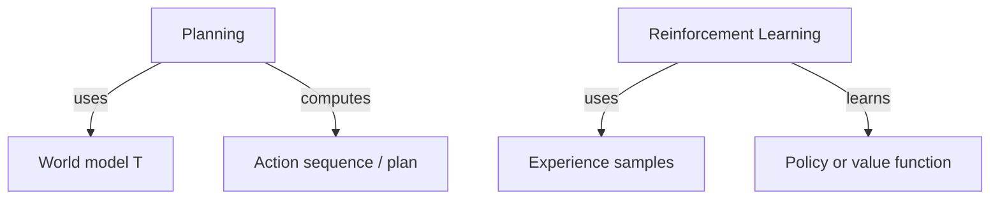

# Meeting 4 — Learning for Agents: How policies get acquired (without drowning in math)

## Learning objectives

By the end of this meeting you should be able to:

- Explain three ways to obtain behavior:
  1) hand‑coded rules/search,
  2) supervised learning (learn predictors),
  3) reinforcement learning (learn policies from reward).
- State core failure modes: overfitting, dataset shift, reward hacking.
- Explain the conceptual bridge:
  - **Planning** computes actions using a model of the world.
  - **RL** learns actions (or values) from experience.
- Understand why deep learning matters but is not “the definition” of AI.

## Learning is one way to get behavior

Learning is not the definition of intelligence. It is a mechanism for producing components:

- classifiers,
- predictors,
- policies,
- value functions.

An agentic system can contain learning, but it can also contain planning, rules, and verifiers.

## Supervised learning (one sentence)

**Definition (Supervised learning).**  
Learn a function that maps inputs to outputs from labeled examples, in a way that generalizes beyond the training set.

Key concepts (math-light):

- **Training set**: data you fit on.
- **Test set**: data you evaluate on.
- **Generalization**: doing well on new examples.
- **Overfitting**: doing well on training data but poorly on new data.

### Worked example: k‑nearest neighbors (kNN)

kNN is useful pedagogically because it makes learning feel concrete:

- Store labeled examples.
- To classify a new point, find the \(k\) closest stored points.
- Predict the majority label.

This emphasizes that “learning” can be implemented with very little math,
and that generalization depends heavily on the data distribution.

### Dataset shift (the reality tax)

**Definition (Dataset shift).**  
The distribution of data at deployment differs from the distribution in training.

Example:
- You trained on daytime photos.
- You deploy at night.
- The model fails for a reason outside the model: the world changed.

In practice, dataset shift is one of the most common causes of ML failure.
Handling it is a systems problem: monitoring, evaluation, retraining, and fallback policies.

## Reinforcement learning (policy learning from reward)

**Definition (Reinforcement learning).**  
Learn a policy from interaction with an environment, using rewards as feedback.

A minimal Markov Decision Process (MDP) description:

- states \(S\)
- actions \(A\)
- transition model \(T(s,a) 	o s'\)
- reward function \(R(s,a,s')\)

### Value functions (intuition)
A value function estimates “how good a state is in the long run.”

You do not need to memorize Bellman equations for this course.
You do need the intuition:

- greedy choices may be bad long-term,
- value estimates incorporate delayed consequences.

### Worked example: tabular Q-learning
In small discrete environments, we can store a Q-table:

- \(Q(s,a)\) = estimated long-term value of taking action \(a\) in state \(s\).

Q-learning repeatedly updates Q-values based on experience.

## Planning vs RL: the conceptual bridge

- Planning is computation on a model.
- RL is learning from experience.
- Hybrid systems exist (model-based RL, planning with learned heuristics).

## Real-world example: why learning alone is not enough

A tool-using assistant might have an excellent language model,
but still fail because:

- it cannot verify tool outcomes,
- it lacks idempotency and double-charges users,
- it has no evaluation suite and regressions ship unnoticed,
- it trusts adversarial observations.

Learning produces behavior components. The agent loop plus reliability plus evaluation produces a system.

---

Next: **Meeting 5 — Reliability: turning behavior into software that doesn’t betray you**.
