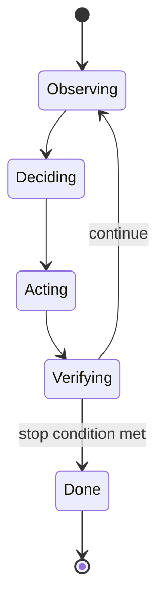
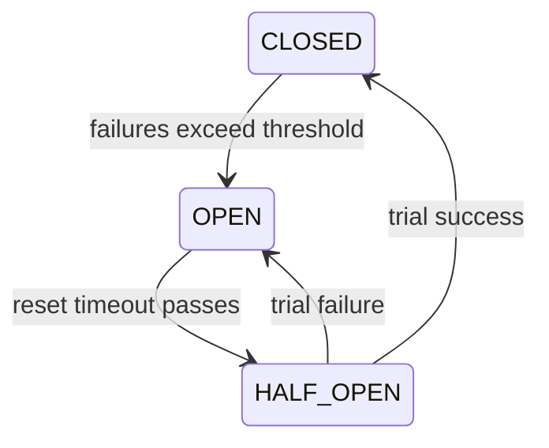

# Meeting 5 — Reliability: Turning behavior into software that doesn’t betray you

## Learning objectives

By the end of this meeting you should be able to:

- Explain why reliability is part of AI systems (especially tool-using agents).
- Use a **workflow/state machine** to make the agent loop explicit.
- Explain and implement:
  - timeouts,
  - retries with backoff,
  - idempotency,
  - circuit breakers,
  - concurrency rules (parallelize reads, serialize writes).
- Explain the security boundary: **“the model proposes; the system disposes.”**
- Describe what a run journal is and why reproducibility matters.

## Reliability is not “ops stuff”

In a tool-using agent, the agent loop interacts with the real world:

- APIs fail.
- Networks are slow.
- Tools return malformed data.
- Users repeat requests.
- Systems are attacked.

Reliability primitives are the difference between a clever demo and a trustworthy system.

## Workflows and state machines

A reliable system makes control flow explicit.
One way is to model the agent loop as a state machine:

This diagram is intentionally boring. Boring is the shape of reliable software.

## Timeouts and retries

### Timeouts
A timeout is a budget on waiting.

Without timeouts:
- a slow dependency can stall your entire system,
- users experience “hung” behavior,
- error recovery becomes impossible.

### Retries with backoff
Retries handle transient failures (e.g., network blips).
Backoff prevents synchronized retry storms.

A common policy is exponential backoff:

- attempt 1: delay \(d\)
- attempt 2: delay \(2d\)
- attempt 3: delay \(4d\)
- cap at a maximum delay

Add jitter (small randomness) so multiple clients do not retry in lockstep.

**Important:** randomness should be seeded for reproducibility in experiments.

## Idempotency: the “don’t double-charge the user” spell

**Definition (Idempotency).**  
An operation is idempotent if repeating it has the same effect as doing it once.

In practice, you implement idempotency using an idempotency key:

- the client sends a unique key for the intended operation,
- the server stores the first outcome for that key,
- repeated requests return the stored outcome without repeating side effects.

Idempotency matters whenever you have:
- retries,
- unreliable networks,
- user refreshes or repeated clicks.

## Circuit breakers: fail fast instead of melting down

A circuit breaker stops sending requests to a failing dependency.

Simplified states:

This prevents cascading failures and gives systems room to recover.

## Concurrency rules: parallelize reads, serialize writes

A useful heuristic:
- reads can often be parallelized (query multiple sources),
- writes should often be serialized (avoid conflicting side effects).

This is not always true, but it is a reliable default.

## Security boundaries: least privilege and deterministic enforcement

The key architectural mantra:

> The model proposes; the system disposes.

Models can be wrong, overconfident, or manipulated.
Therefore:

- enforce allowlists and permissions outside the model,
- validate action schemas deterministically,
- type side effects (read/write),
- never give tools more privilege than necessary.

## Observability and evidence

A **run journal** is a black box recorder for the agent loop.

It should store:

- observations,
- proposed actions,
- verified outcomes (evidence),
- stable identifiers and hashes for replay.

A reliable system can say: “Here is what happened,” not “It felt like it worked.”

---

Next: **Meeting 6 — Evaluation: the scientific method for AI systems**.
