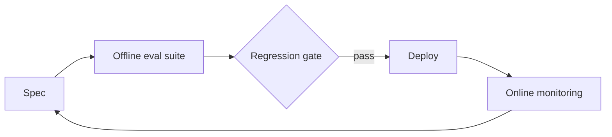

# Meeting 6 — Evaluation: The scientific method for AI systems (how you stay honest)

## Learning objectives

By the end of this meeting you should be able to:

- Explain why **specification** is the root of evaluation.
- Distinguish three evaluation modes:
  - in-run verification,
  - offline evaluation suites,
  - online monitoring.
- Use simple scoring methods and understand when to involve humans.
- Handle stochasticity responsibly (variance, tail risk).
- Design adversarial evaluation cases (prompt injection attempts, tool poisoning, permission probes).

## Specs imply evals

**Definition (Specification).**  
A specification is a precise statement of success criteria and constraints.

If you cannot specify “good,” you cannot improve anything—only change it.

A specification should include:
- what success means,
- what failure means,
- budgets (time, steps, side effects),
- safety constraints.

## Three evaluation modes

### 1) In-run verification
This happens inside the loop:

- Did the tool action succeed?
- Did we observe evidence of the intended effect?
- Did we violate constraints?

In-run verification produces **evidence**.

### 2) Offline evaluation suites
Offline evaluation uses a fixed dataset or suite of test cases.
It is the foundation of regression testing.

Examples:
- planning tasks with known optimal costs,
- Bayes update sanity checks,
- idempotency invariants,
- adversarial cases.

Offline eval is where you learn the most, cheaply.

### 3) Online monitoring
Online monitoring observes real usage:

- SLIs (service level indicators): latency, error rate, success rate.
- SLOs (service level objectives): acceptable thresholds.
- drift detection: changing input distributions.
- incident response: what you do when things go wrong.

## A minimal evaluation pipeline

This loop is a version of the scientific method:
hypothesize, test, update.

## Scoring methods (pragmatic hierarchy)

1. **Rule checks first** (cheap, reliable).
   - schemas valid,
   - constraints obeyed,
   - optimality conditions for planning problems.

2. **Humans for subjective judgments**.
   - clarity,
   - helpfulness,
   - pedagogical quality.

3. **Model-judges only when calibrated**.
   Model judges can be useful, but they need validation like any other metric.

## Stochasticity hygiene

Many AI systems are stochastic (randomness, sampling, noisy environments).
You should therefore:

- run repeated trials,
- report variance, not just averages,
- pay attention to tail risk (“rare bad events”).

**Rule of three (intuition).**  
If you observe zero failures in 3 independent trials, the failure rate could still be ~1/3.
This is not a formal guarantee, but it is a healthy reminder to be cautious.

## Adversarial evaluation (security as test cases)

Treat security issues as evaluation cases, not as “later.”

Examples:
- indirect prompt injection attempts,
- tool output that includes malicious instructions,
- permission escalation requests,
- attempts to exceed budgets or side-effect limits.

The goal is not paranoia. The goal is repeatability:
you want to be able to say “this attack was blocked,” and prove it.

## A closing map: fast vs slow changing knowledge (stay sane)

- Fast changing:
  - prompts,
  - framework APIs,
  - model product names.

- Slow changing (timeless):
  - state machines,
  - idempotency,
  - observability,
  - evaluation discipline,
  - agent perspective.

If you anchor on the slow-changing foundations, you can adapt to any new toolchain.

---

End of course. The next step is not “learn a bigger model.”
The next step is “build a tighter loop.”
