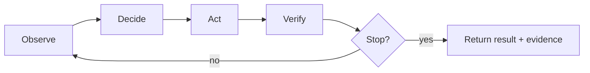

# Meeting 1 — The Agent Loop and Evidence

## Central question

What is an AI system when you strip away hype?

This meeting introduces the core spine of the course:

> **observe → decide → act → verify → stop**

In this repository, the running project is **CourierBot**, an agent that moves on a grid and can call tools.

---

## Glossary (minimal)

- **Agent loop:** a repeating control structure that takes observations and produces actions.
- **Observation:** information the agent receives from the world (including tool outputs).
- **Action:** a proposal by the agent (move, call tool, stop).
- **Evidence:** artifacts that let you justify and debug outcomes (journals, receipts, assertions).
- **Budget / stop rule:** explicit limits on resources (steps, tool calls) and termination conditions.

---

## The loop structure



### Interpretation

- **Observe:** read the world state (position, blocked directions).
- **Decide:** pick an action according to your policy.
- **Act:** the system executes the action.
- **Verify:** check the effect (“did the move succeed?”, “did the report apply?”).
- **Stop:** if you reached a goal or exceeded a budget, terminate.

---

## Worked example (toy map)

Map:

```
######
#S...#
#....#
#....#
#...G#
######
```

A minimal policy can be greedy: “move toward the goal along x, then y.”

A journal entry for a step (conceptually) includes:

- observation: current position + blocked directions
- action: `move(E)`
- outcome: move succeeded?
- verification: matches expected effect
- budgets: step count, tool calls

---

## Analogy

Treat the journal like a **black box recorder** on an airplane:
it does not prevent crashes, but it makes crashes *explainable* and therefore fixable.

---

## Exercise

1. Run `python scripts/run_lab1.py --seed 1`.
2. Open the journal under `runs/<run_id>/journal.jsonl`.
3. Find the first `step` event and answer:
   - What was the observation?
   - What action was chosen?
   - What does verification say?
