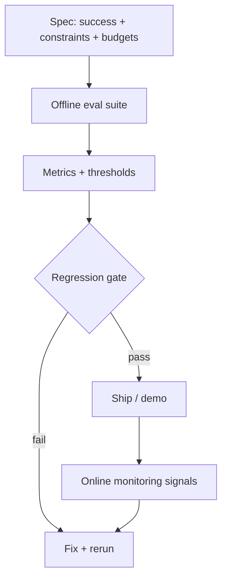

# Meeting 6 — Evaluation Upgrade (Make it a Discipline)

## Central question

How do we stay honest about whether the system is good?

Evaluation is the scientific method applied to AI systems:
specify success, run experiments, measure outcomes, and gate regressions.

---

## Glossary (minimal)

- **Spec:** a written definition of success criteria + constraints + budgets.
- **Offline evaluation:** run a fixed suite of tests with controlled randomness.
- **Regression gate:** a threshold that must be met before you “ship.”
- **Monitoring:** signals collected in deployment (conceptual here).
- **Adversarial test:** a test designed to break assumptions safely.

---

## Evaluation pipeline

The spec for this repository is in `spec.md`.

The harness is in:

- `learning_compiler/evaluation/harness.py`
- `learning_compiler/evaluation/metrics.py`

---

## Adversarial case: injection-style tool output

A tool may return:

- a valid JSON object, plus
- trailing natural language that looks like instructions

The system must treat tool outputs as **data**, not commands.

In this repository, the validator:
- parses the leading JSON object,
- ignores trailing text,
- records a warning in the journal.

---

## Exercise

1. Run `python scripts/run_lab6_eval.py --seed 1 --runs 10`.
2. Find the `eval_adversarial` run journal.
3. Confirm the journal includes a warning about trailing text.
4. Explain why this is not “prompting” but **system design**.
