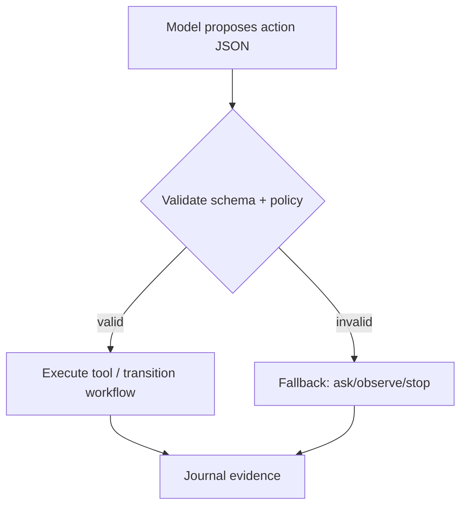
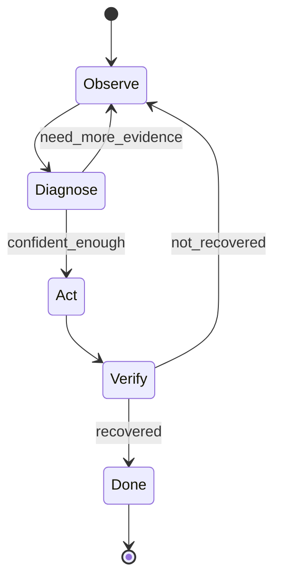

## Introduction to AI Systems (GenAI Agents)

**Theme:** *Agency under uncertainty, with Reliability + Evaluation as first-class.*
**Format:** 6 laboratory meetings × 1 hour (explanation + guided build + run tracing)
**Audience:** 2nd‑year undergrads; strong coders; math‑shy; AI from zero
**Time context:** February 2026
**Goal:** A worldview-stable mental map for “AI in the wild”: **models are components; systems are agents with evidence.**

---

# Design constraints (explicitly aligned to your new requirement)

### Data policy (hard constraint)

* **No external real-world datasets** (no scraping, no ticket archives, no institutional docs, no “collect examples from users”).
* Any “data” used in demos must be:

  * **synthetic and course-provided**, or
  * **programmatically generated** (seeded simulation, templated docs, expert traces),
  * with **ground truth available** in code for evaluation (no human labeling).

This isn’t just compliance—it’s also a pedagogy win: students learn agency, reliability, and evaluation in a **closed world** where truth is checkable.

---

# Running artifact (one project, upgraded weekly)

## Main project: **SimOpsBot — a GenAI incident-response agent in a toy production system**

A small agent that triages and mitigates outages in a **simulated microservice environment**.

### Why this project mitigates the dataset requirement by construction

* Observations (metrics/logs/traces) are **generated by the simulator**.
* “Knowledge” (runbooks) is **template-generated** and shipped with the repo.
* Scenarios are **seeded and programmatically generated**.
* Evaluation can be largely **automatic** (the simulator knows ground truth and can compute outcome metrics).

### Simulator sketch (course-provided)

* **Services:** `frontend`, `api`, `db`, `cache`, `auth` (toy but realistic enough)
* **Observations/tools (read-only):**

  * `get_metrics(service, window)` → latency/error-rate/etc. (noisy/delayed)
  * `tail_logs(service, n)` → log lines (some irrelevant, some adversarial)
  * `trace_request(id)` → partial trace
  * `get_deployments(service)` → versions
* **Actions/tools (side effects):**

  * `restart(service, idempotency_key)`
  * `rollback(service, version, idempotency_key)`
  * `scale(service, replicas, idempotency_key)` (optional)
  * `flush_cache(idempotency_key)` (optional)
* Tools can **timeout, fail, or return malformed responses** (injected).

### Agent loop (the spine you teach every week)

> observe → decide → act → verify → stop (with budgets)

```mermaid
flowchart LR
  O[Observe: metrics/logs/tools] --> D[Decide: propose next step]
  D --> A[Act: execute allowed tool]
  A --> V[Verify: check effect/evidence]
  V --> S{Stop? (budget/spec)}
  S -- no --> O
  S -- yes --> R[Return: mitigation + report + evidence]
```

---

# Three invariants (repeat every meeting; become habits)

1. **Budgets / stop rules** (time, steps, tool calls; explicit abstain conditions)
2. **Evidence / run journal** (replayable record: observations, actions, outcomes, verification)
3. **Tool boundaries (“model proposes; system disposes”)** (policy enforced outside model)

---

# Learning outcomes (T-shaped)

## Depth (agentic systems competence)

Students can:

* Implement an **agent loop** with explicit state, budgets, evidence journaling
* Use a GenAI model to propose **structured actions** under strict validation
* Handle uncertainty operationally: **ask/observe more vs act**, and **abstain** when evidence is insufficient
* Integrate tools with **contracts**, **verification**, and **idempotency**
* Enforce safety/security boundaries (allowlists, argument constraints; injection-as-untrusted-input)
* Build an **evaluation harness** with regression gates and adversarial test cases

## Breadth (AI worldview)

Students can explain (at high level, without math overload):

* Why “AI ≠ deep learning ≠ LLMs,” and where LLMs fit in the larger AI landscape
* How “search” and “probability” still underpin modern GenAI systems (conceptually)
* Why evaluation and reliability are not “ops extras” but part of an intelligent system that acts

---

# Risk register (and baked-in mitigations)

### Risk A: “AI = LLM prompting”

**Mitigation:** structured actions + policy + verification; minimal attention to prompt tricks; framework-agnostic `LLMAdapter`.

### Risk B: Overconfidence/hallucination normalization

**Mitigation:** evidence requirement for claims; “no evidence → ask/abstain” by Meeting 3; verification for side effects.

### Risk C: Security naïveté (prompt injection/tool misuse)

**Mitigation:** Meeting 5 red-team suite; treat logs/runbooks as **untrusted input**; strict allowlists and deterministic checks.

### Risk D: Dataset creep (students pulling real incident docs/logs)

**Mitigation:** simulator + templated runbooks; explicit “no external data” course policy; everything generated from seeds/templates.

### Risk E: 6 hours is tight

**Mitigation:** one artifact; one capability upgrade per week; starter code; companion reading carries extended explanations.

---

# Course structure and grading (lightweight, evidence-driven)

### Weekly checkpoint (Meetings 1–5)

Submit:

* code for the week’s upgrade,
* 1–2 run journals (`.jsonl`),
* a short note: *one failure case + what changed + evidence it improved.*

### Final (Meeting 6)

Submit:

* `spec.md` (success criteria, budgets, unacceptable failures),
* `eval_runner.py` + scenario suite generator,
* an eval report showing regression gate results.

---

# The 6-meeting syllabus (reduced scope, preserved value)

Below, “In-class scope” is what must fit in 60 minutes. Anything else is explicitly relegated to the companion “book.”

---

## Meeting 1 — What AI Systems Are: The Agent Loop + Evidence

**Upgrade:** build the minimal agent skeleton: loop, state, journal, budgets, and a stub “decider”.

### In-class scope (tight)

* AI as **agentic behavior under constraints**, not “a model that answers”
* The loop: observe → decide → act → verify → stop
* Minimal objects to make agents debuggable:
  **Intent, State, Action, Observation, Evidence**
  (Plan is introduced as “later.”)
* The three invariants (budgets, journal, tool boundary)

### Lab flow (60 min)

* 0–10: course map (Behavior / Reliability / Evaluation)
* 10–25: implement `RunJournal` + `AgentState` + budgets
* 25–45: implement agent loop with a trivial rule-based decider
* 45–60: run + inspect journal; define what counts as evidence vs “narration”

### Deliverable

* `agent_loop.py`, `journal.jsonl`
* A deterministic run that produces a replayable trace

### Companion chapter 1 (Markdown, formal tone)

* Definitions + worked run trace
* Analogy: “flight recorder for agents”
* Mermaid: loop diagram (as above)

---

## Meeting 2 — GenAI as a Component: Structured Action Proposals + Validation

**Upgrade:** replace the stub decider with an LLM that proposes **structured actions**; system validates.

### In-class scope (reduced vs earlier)

* “Model proposes; system disposes” made concrete
* **Structured outputs** (schemas) as the main safety/engineering lever
* Determinism vs stochasticity (only what you need):

  * why you want reproducibility for debugging/eval
  * when you might allow randomness (rarely, and intentionally)

> Scope cut: deep dives into “next-token distributions” and decoding algorithms are *reading only*.

### Lab flow (60 min)

* 0–10: architecture: model in the loop (but not in control)
* 10–30: define `ActionSchema` (e.g., `OBSERVE`, `DIAGNOSE`, `ACT`, `ASK`, `FINAL`)
* 30–45: implement parse/validate; reject invalid proposals; fallback strategy
* 45–60: journal model proposals + validation outcomes; compare two runs (deterministic settings)

### Deliverable

* `llm_adapter.py`, `action_schema.py`, validator + fallback path
* Journals now include: proposal, validation result, executed action

### Companion chapter 2

* Mermaid: proposal → validation → executor pipeline
* Worked example: invalid output handled safely



---

## Meeting 3 — Uncertainty Operationalized: Hypotheses, Evidence, Ask vs Act

**Upgrade:** add observation tools (metrics/logs) and a simple uncertainty discipline.

### In-class scope (math-light, system-heavy)

* Observations are noisy/incomplete; uncertainty is normal
* Maintain a **hypothesis list** (not full Bayes):

  * hypothesis → supporting evidence IDs → “confidence” as a simple score/level
* Ask vs act rule:

  * observe more / ask for clarification when evidence is insufficient or stakes are high
* Evidence discipline: every diagnosis must cite journal evidence (metric IDs, log line IDs)

> Scope cut: Bayes math and POMDP formalism are reading-only appendices.

### Lab flow (60 min)

* 0–10: what uncertainty looks like in metrics/logs
* 10–25: implement tools `get_metrics`, `tail_logs` (simulated)
* 25–45: implement hypothesis tracker + evidence linking
* 45–60: implement “ask/observe more” behavior when confidence low; run a scenario with ambiguity

### Deliverable

* `hypotheses.py` (data structure + update rules)
* “No-evidence diagnosis” prevented by code (must cite evidence)

### Companion chapter 3

* Worked trace: ambiguous outage → additional observation → grounded hypothesis
* Analogy: “medical differential diagnosis” (but engineering-safe)

---

## Meeting 4 — Acting Safely: Tool Contracts, Verification, Idempotency, and Workflows

**Upgrade:** add side-effect actions (restart/rollback) with verification and idempotency.

### In-class scope (reduced, focused)

* Tool contracts (schema validation + normalized error handling)
* **Verification**: after action, check effect via metrics/health
* **Idempotency**: retries must not duplicate side effects
* Explicit workflow/state machine (keeps systems debuggable)

> Scope cut: concurrency strategies, circuit breakers, and complex orchestration patterns are reading-only.

### Lab flow (60 min)

* 0–10: why side effects change everything
* 10–30: implement `restart`/`rollback` wrappers with validation + idempotency keys
* 30–45: implement verify step (`check_health` + metric improvement rule)
* 45–60: refactor into a tiny state machine; run a failure-injection scenario (timeout + retry)

### Deliverable

* `tools_wrapped.py` (contracts, idempotency, retries)
* `workflow.py` (explicit states)
* Journal includes: tool request, tool receipt, verification evidence

### Companion chapter 4

* Mermaid state machine + worked incident: “bad deploy → rollback → verify”



---

## Meeting 5 — Reliability + Security: Untrusted Inputs, Prompt Injection, Safe Degradation

**Upgrade:** add policy enforcement + red-team tests + safe degradation behavior.

### In-class scope (timeless security framing)

* Injection as a general principle: **untrusted input trying to control execution**
* Allowlists + argument constraints enforced outside the model
* Failure injection: tools can be hostile/unreliable; system must degrade safely
* “Unsafe action attempt rate must be zero” as an evaluation-ready requirement

### Lab flow (60 min)

* 0–10: threat model for agentic systems
* 10–25: introduce adversarial runbook/log content (synthetic)
* 25–45: implement `policy.py` (permissions + constraints + deny rules)
* 45–60: run red-team suite; confirm journal shows blocked attempts + safe fallback

### Deliverable

* `policy.py`
* `redteam_cases.py` (synthetic, template-generated)
* Demonstration run where injection fails to cause forbidden tool calls

### Companion chapter 5

* Analogy: SQL injection/XSS → instruction injection
* Worked example: malicious log line handled as data, not command

---

## Meeting 6 — Evaluation: Specs, Offline Scenario Suites, Regression Gates

**Upgrade:** make the system scientifically testable: spec + eval harness + gate.

### In-class scope (reduced, high-impact)

* Specs define “good”:

  * success criteria, budgets, constraints, unacceptable failures
* Offline evaluation:

  * scenario suite generated from seeds
  * regression gates (thresholds) to prevent backsliding
* Minimal metrics for agents (objective, automatable):

  * recovery success rate
  * mean time/steps to recovery
  * verification success rate
  * evidence compliance rate
  * unsafe action attempt rate (must be 0)

> Scope cut: online monitoring (SLIs/SLOs) is mentioned as “next course / appendix,” not taught in depth.

### Lab flow (60 min)

* 0–10: write `spec.md` (one page, concrete)
* 10–35: implement `eval_runner.py` + scenario generator (seeded)
* 35–50: compute metrics + set regression thresholds
* 50–60: compare baseline vs final agent on the same suite; interpret failures via evidence

### Deliverable (final)

* `spec.md`, `eval_runner.py`, `scenarios_generate.py`
* `report.md` with metric table + 2 failure case analyses using journal evidence

### Companion chapter 6

* Mermaid: spec → suite → gate → ship

```mermaid
flowchart TD
  Spec[Spec] --> Suite[Offline eval suite (seeded)]
  Suite --> Metrics[Metrics]
  Metrics --> Gate{Regression gate}
  Gate -- pass --> Release[Release]
  Gate -- fail --> Fix[Fix + rerun]
```

---

# Companion “book” outline (Markdown; formal academic tone)

Each chapter includes: glossary, Mermaid diagram, analogy, worked example with journal excerpt, exercises.

1. **Agents and AI Systems**: loop, evidence, budgets, worldview map
2. **GenAI in the Loop**: structured actions, validation, determinism
3. **Uncertainty Without Math Trauma**: hypotheses, evidence, ask vs act
4. **Tool Use That Doesn’t Betray You**: contracts, idempotency, verification, workflows
5. **Security & Reliability for Agentic Systems**: untrusted input, policy, safe degradation
6. **Evaluation as the Scientific Method**: specs, offline suites, regression gates

**Appendices (optional depth, not class time):**

* AI landscape map (search, probability, learning, RL—where they fit)
* Minimal probability primer (discrete tables, intuition)
* Decoding details (for curious students)
* Monitoring mindset (SLIs/SLOs, drift) as “where this goes next”

---

# What this version deliberately *doesn’t* do (scope reduction without value loss)

* No model training / fine-tuning demos (avoids dataset issues; saves time)
* No deep decoding theory in class (kept conceptual; reading for interested students)
* No heavy probabilistic formalism (uncertainty is taught operationally)
* No framework-specific content (keeps it timeless)

You still get the worldview-shaping core—**agency under uncertainty with reliability + evaluation**—and the project choice makes your “no datasets” rule feel like physics, not bureaucracy.
