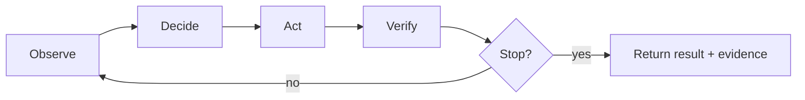
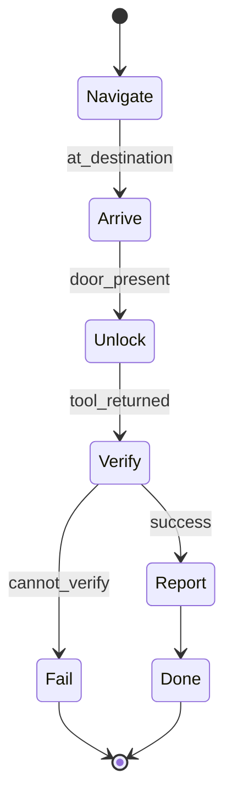
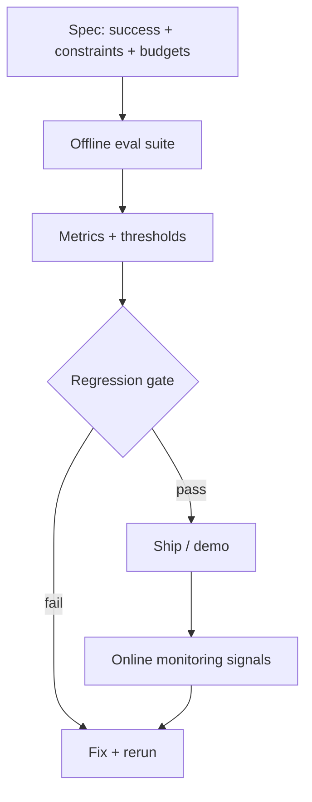

Below is a **fully updated 6×1h syllabus** that implements the “one agent, six upgrades” approach, trims concept density per hour, and pushes the “adult invariants list” into **reading/appendix** while keeping three invariants **repeating every week**:

1. **Budgets / stop rules**
2. **Evidence / run journal (replayability)**
3. **Tool boundaries (“model proposes; system disposes”)**

It’s still **Agentic Systems as the spine**, still “timeless foundations,” just paced so you’re not forced to teach a semester’s worth of prerequisites in week 1.

---

# Course: AI From Zero (Agentic Systems Spine) — 6×1h Labs

## Audience and assumptions

* 2nd‑year undergraduates
* Strong programmers (data structures, basic debugging)
* Weak math prep (we avoid calculus; probability is discrete and table-based)
* No prior AI background

## Course throughline (the one idea that keeps paying rent)

> **An AI system is an agent loop:** observe → decide → act → verify → stop
> under uncertainty and resource limits.
> **The model is a component, not the system.**
> A robust agent is **Behavior + Reliability + Evaluation**.

This follows the **Russell/Norvig agent view**: an agent maps percept history to actions, and “rationality” means choosing actions that best achieve goals given what the agent knows and what it wants.

### Where GenAI/LLMs fit (2026 orientation)

GenAI models (including LLMs) are powerful, but in this course they are treated as **components inside the agent loop**, not the definition of AI. Concretely, they can help with **proposing** plans, interpreting messy observations, or translating intent into structured actions—but the system must still enforce budgets, boundaries, and verification:

* **Model proposes; system disposes** (permissions, allowlists, contracts live outside the model)
* Outputs are **observations/proposals**, not truth-by-default
* Success is defined by **specs + evidence**, not fluency

### Running project: **CourierBot**

A small Python agent that navigates a **campus grid** and uses **simulated tools** (functions that can fail, have side effects, and return messy outputs). Each meeting adds one capability, while keeping the same agent skeleton.

* **World**: grid map with walls, destinations, optional hazards
* **Actions**: move N/S/E/W, scan, ask_clarification, use_tool(name, args)
* **Tools (simulated)**: `door_unlock()`, `lookup_map()`, `report_delivery()` — can fail, timeout, or return malformed data
* **Artifacts produced every week**:

  * a **run journal** (structured log with stable IDs)
  * a **stop rule** (explicit budget: steps, time, tool calls)
  * a **verification step** (“did the intended effect happen?”)

---

# Learning outcomes (T‑shaped)

## Depth (agentic core)

By the end, students can:

* Implement an **agent loop** with explicit **state, intent, actions, observations, evidence**
* Add **planning** (A* in a clean world)
* Add **uncertainty handling** (simple Bayesian belief update + ask/act)
* Treat ML as **one way to obtain behavior** (a learned policy component)
* Engineer **reliability boundaries** (validation, retries, idempotency, journaling)
* Build an **evaluation harness** (offline tests + adversarial cases + regression gate)

## Breadth (orientation map)

Students can explain, at a high level:

* How search, probability, supervised learning, and RL relate to **policies**
* Why reliable agents are mostly **systems engineering + evaluation discipline**
* What changes fast (frameworks/prompts) vs slow (state machines, contracts, evidence, evaluation)

---

# Format and assessment

**6 laboratory meetings × 1 hour** (explanation + guided implementation + run traces).

Suggested lightweight assessment (works even if you grade pass/fail):

* Weekly checkpoint: submit code + one run journal + one paragraph “what failed / what I changed”
* Final submission: CourierBot + offline eval suite + short spec (success criteria + budgets + constraints)

---

# Companion “book” (Markdown) structure

Each meeting has a short chapter in **formal academic tone** with:

* definitions of terms (glossary box)
* Mermaid diagrams
* one worked example (step-by-step trace)
* one real-world analogy
* one small exercise

(You can hand students the chapter before class; it reduces how much prerequisite explaining you must do live.)

---

# Meeting-by-meeting syllabus

## Meeting 1 — The Agent Loop + Evidence (build the skeleton)

**Central question:** “What is an AI system when you strip away hype?”

### Core concepts (in-class; keep it tight)

* Agent loop: **observe → decide → act → verify → stop**
* The six objects (introduced *only* at the level needed to code them):

  * **Intent** (goal + constraints)
  * **State** (what the agent currently believes)
  * **Plan** (optional placeholder this week)
  * **Action**
  * **Observation**
  * **Evidence** (journal entries, tool receipts, assertions)
* The three invariants (start using them immediately):

  * **budget / stop rule**
  * **run journal**
  * **tool boundary** (even if “tool” is just a Python function)

### In-class arc (60 minutes)

* 0–5: mental map + what the agent loop is
* 5–20: implement the minimal loop + data structures for state and journal
* 20–45: run CourierBot in a deterministic tiny map (no uncertainty yet)
* 45–60: “verification” step + stop rule + inspect a run journal together

### Hands-on deliverable

* `agent.py`: a loop that can reach a destination with *hardcoded* behavior
* `journal.jsonl`: each step logs observation/action/result with stable run_id

### Companion book chapter (pre/post)

* “Agentic Systems 101: Loop, Evidence, Budgets”
* Mermaid (used in reading and optionally shown in class):

**Terms introduced (limit):** agent loop, state, observation, action, evidence, budget/stop rule.

---

## Meeting 2 — Planning Upgrade (A* in a clean world)

**Central question:** “How can an agent decide systematically instead of vibing?”

### Core concepts (in-class)

* Problem formulation (only what you need to implement):

  * states, actions, transitions, goal test, path cost
* **BFS → A*** as the single narrative arc

  * BFS finds shortest paths in unweighted graphs
  * A* uses a heuristic to search efficiently while preserving optimality (intuition-level)
* “Evidence” becomes: the **path** + why it’s believed correct

### Explicit scope cuts

* DFS, Uniform Cost Search: **reading only**
* Proofs / complexity analysis: **optional enrichment**

### In-class arc (60 minutes)

* 0–8: state space as a graph (draw one tiny map)
* 8–30: implement BFS (or provide starter BFS and trace it)
* 30–50: upgrade to A* with Manhattan distance heuristic
* 50–60: add a stop rule (node expansion budget) + journal the frontier size

### Hands-on deliverable

* `planner.py`: A* that returns a plan (sequence of moves)
* Journal includes: cost, heuristic, chosen node (so plans become debuggable)

### Companion book chapter

* “Search as the Assembly Language of Agency”
* Worked trace: A* on a 6×6 grid with 2 obstacles

**Terms introduced (limit):** state space, frontier, heuristic, A*.

---

## Meeting 3 — Uncertainty Upgrade (beliefs + ask vs act)

**Central question:** “What should an agent do when it can’t trust what it sees?”

### Core concepts (in-class)

* Probability as **bookkeeping for uncertainty** (tables, not calculus)
* Bayes update as an operator: **prior → evidence → posterior**
* Belief state (informal): keep a distribution over hypotheses when the world is partially observed
* **Ask vs act** rule (decision intuition):

  * ask when uncertainty is high **and** cost of being wrong is high
  * otherwise take **safe information-gathering actions**
* Tool outputs are **observations**, not truth-by-default (trust discipline)

### Concrete implementation choice (keep it teachable)

Add a **noisy scanner**:

* `scan()` returns “door is locked” but is wrong 20% of the time
* CourierBot maintains belief: `P(door_locked)` and chooses:

  * ask for confirmation (costs a step/tool call), or
  * try unlock (may waste time / trigger failure)

### In-class arc (60 minutes)

* 0–10: discrete probability tables + why base rates matter
* 10–30: implement Bayes update function for one binary variable
* 30–50: integrate into CourierBot decision: ask vs act
* 50–60: journal belief over time + inspect one failure case

### Companion book chapter

* “Beliefs: How to Stay Honest in Fog”
* Includes a worked Bayes table and a small “cost of error” scenario

**Terms introduced (limit):** prior/posterior, Bayes update, belief state, uncertainty.

---

## Meeting 4 — Learning Upgrade (a learned policy as a component)

**Central question:** “How can behavior be acquired from data—and why does it still fail?”

### Core concepts (in-class)

* Three ways to get behavior (framed as a systems choice):

  1. hand-designed (rules/search),
  2. learned predictors (supervised),
  3. learned decision-making (RL) — **conceptual only**
* Supervised learning in one operational sentence:

  * learn a mapping `state → action` that generalizes beyond training examples
* Failure modes (must be felt, not merely named):

  * overfitting (memorization)
  * dataset shift (training ≠ deployment)

### Concrete implementation choice (math-light, code-first)

**Behavior cloning from the planner**:

* Use A* to generate “expert” trajectories on many random maps
* Train a simple classifier (even a basic model is fine: logistic regression / decision tree / kNN)
* Replace the planner with the learned policy and compare performance on:

  * “in-distribution” maps (similar to training)
  * “shifted” maps (more obstacles / different layouts)

### In-class arc (60 minutes)

* 0–10: learning is “compressing experience into a function”
* 10–25: generate dataset: `(features from state) → (expert action)`
* 25–45: train model + evaluate accuracy
* 45–60: deploy inside agent loop + observe failure under shift (with journals)

### Companion book chapter

* “Learning for Agents: Powerful, Not Sovereign”
* Short RL orientation sidebar (MDP, reward, exploration) **without implementation**

**Terms introduced (limit):** supervised learning, generalization, dataset shift, policy.

---

## Meeting 5 — Reliability Upgrade (turn behavior into software that won’t betray you)

**Central question:** “How do we stop an agent from becoming an expensive ghost story?”

### Core concepts (in-class)

Keep it to **four primitives**, all demonstrated with failures you inject on purpose:

1. **Validation** (schemas / sanity checks on tool outputs)
2. **Timeouts + retries** (with backoff; simple)
3. **Idempotency** (don’t double-apply side effects)
4. **Run journal + replay** (evidence that survives debugging)

Plus the rule that anchors tool safety:

* **Model proposes; system disposes** (policy enforcement outside the model)

### Make the loop explicit: a tiny state machine

You now restructure CourierBot into states like:

* `NAVIGATE → ARRIVE → UNLOCK → VERIFY → REPORT → DONE/FAIL`

### In-class arc (60 minutes)

* 0–10: what “reliability” means for agents (failure taxonomy)
* 10–30: refactor loop into an explicit workflow/state machine
* 30–50: add wrappers for tool calls (validate/retry/timeout/idempotency keys)
* 50–60: run failure-injection scenarios and read the journal like a black box recorder

### Companion book chapter

* “Reliability Primitives That Outlive Frameworks”
* Mermaid state machine:

**Terms introduced (limit):** validation, timeout, retry, idempotency, state machine, replayability.

---

## Meeting 6 — Evaluation Upgrade (make it a discipline, not a vibe)

**Central question:** “How do we stay honest about whether the system is good?”

### Core concepts (in-class)

* A **spec** as the root of evaluation:

  * success criteria + constraints + budgets + unacceptable failures
* Three evaluation modes (shown via one pipeline, not three lectures):

  1. **in-run verification** (did the action actually happen?)
  2. **offline eval** (fixed test suite + regression gate)
  3. **online monitoring** (conceptual: SLIs/SLOs, drift)
* Adversarial cases as tests, not fear:

  * “hostile observation pretending to be a command” (injection-style scenario)
* Stochasticity hygiene (kept light):

  * fixed seeds + repeated trials when randomness exists

### In-class arc (60 minutes)

* 0–10: write a minimal spec (one page, bullet constraints)
* 10–35: build offline eval harness (10–30 seeded maps + failure injection)
* 35–50: define metrics + regression gate (pass/fail threshold)
* 50–60: final demo run + interpret results from evidence, not vibes

### Hands-on deliverable (final)

* `spec.md`: what “good” means for CourierBot
* `eval/`: offline tests that run automatically and output a score report
* a final journal bundle showing at least one adversarial case handled safely

### Companion book chapter

* “Evaluation: The Scientific Method for AI Systems”
* Mermaid eval pipeline:

**Terms introduced (limit):** spec, offline eval, regression gate, monitoring, adversarial test.

---

# Appendix: topics intentionally de-emphasized in live hours (still “in the book”)

These remain valuable, but they become meaningful *after* students have seen failures and built the skeleton.

* Classical AI extras: UCS/DFS details, admissibility proofs, complexity bounds
* Probability extras: Markov property formalism, POMDP notation
* Learning extras: Bellman equations, deep nets internals, function approximation theory
* Engineering extras: circuit breakers, concurrency rules, full security architecture
* “Adult invariants” full list: effect typing, operability, reproducibility discipline, etc. (kept as a checklist + case studies)

---

# Why this revised syllabus is teachable in 6 hours

* Each meeting adds **one capability upgrade** to the same agent.
* New vocabulary is rationed; students learn by **running, tracing, and journaling**.
* The “timeless foundations” are preserved, but tied to concrete artifacts:

  * behavior (planning / belief / learned policy)
  * reliability (contracts / idempotency / journaling)
  * evaluation (spec / offline suite / regression gates)

This gives you the worldview-shaping goal—without requiring you to smuggle a full CS+stats bootcamp into 360 minutes.
