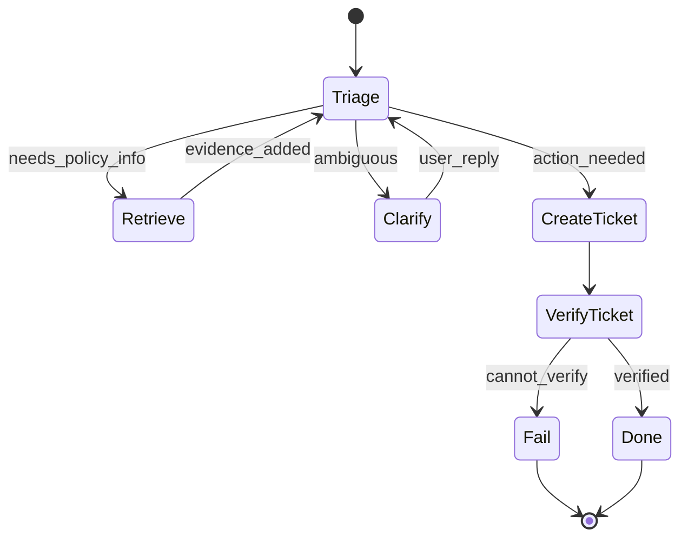
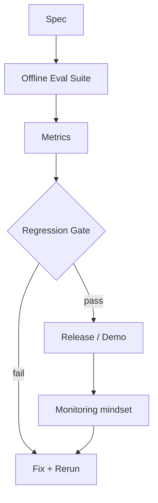

# Introduction to AI Systems (GenAI Agents)

**Main theme:** *Agency under uncertainty, with Reliability + Evaluation as first-class.*
**Format:** 6 laboratory meetings × 1 hour (explanation + guided build + run tracing)
**Audience:** 2nd‑year undergrads; strong coders; math‑shy; starting AI from zero
**Promise:** A worldview-stable mental map for the 2026 AI boom: **models are components; systems are agents with evidence.**

---

## Course thesis (the mind-shaping part)

> **AI is goal-directed behavior under constraints.**
> **A GenAI model can propose behavior, but only a system can safely act.**
> Real agents require **Behavior + Reliability + Evaluation** inside an explicit loop.

We use GenAI because it’s the 2026 reality students will touch — but we **teach what doesn’t fossilize**: stop rules, evidence, contracts, verification, and spec-driven evaluation.

---

## Running artifact: one agent, six upgrades

### The artifact: **CampusDesk** (a tiny helpdesk agent)

A small agent that handles requests like:

* “My Wi‑Fi is broken.”
* “How do I install X?”
* “Open a ticket for my lab machine.”

It can:

* consult a **knowledge base** (retrieval tool),
* ask clarifying questions,
* take **tool actions** (create a ticket, check status),
* verify outcomes,
* stop with a justified answer + evidence.

### Why this domain works (pedagogically)

* It naturally forces **uncertainty** (incomplete info, ambiguous requests).
* It naturally forces **reliability** (tools fail, outputs are messy).
* It naturally forces **evaluation** (“did it actually fix the problem?”).
* It supports safe sandboxing (no real side effects).

### Agent loop (repeated every week)

* **Observe** (user input, tool outputs)
* **Decide** (LLM proposes a structured step)
* **Act** (system executes allowed tool calls)
* **Verify** (check effect / evidence)
* **Stop** (explicit budget and success criteria)

```mermaid
flowchart LR
  O[Observe] --> D[Decide]
  D --> A[Act]
  A --> V[Verify]
  V --> S{Stop? (budget/spec)}
  S -- no --> O
  S -- yes --> R[Return result + evidence]
```

---

## Three invariants (non-negotiables) used every meeting

These show up in code, in journaling, and in grading.

1. **Budgets / stop rules**
   Steps, time, tool calls, and “when to abstain” are explicit.

2. **Evidence / run journal (replayability)**
   Every run produces a structured journal: what was observed, what was done, what evidence supports the outcome.

3. **Tool boundaries (“model proposes; system disposes”)**
   The model never gets direct authority. The system validates, allowlists, and executes.

---

## Risk register (and how the syllabus mitigates it)

### Risk A: Students conclude “AI = LLMs”

**Mitigation built in**

* Meeting 1 includes a compact **AI landscape map** and a recurring 5‑minute “where this fits” slot.
* Meeting 2 explicitly frames **decoding as search** (a bridge to classical AI).
* Meeting 6 closes with a “slow vs fast” map: what’s timeless vs toolchain churn.

### Risk B: Course becomes “prompt tricks & framework tourism”

**Mitigation built in**

* Provider/framework-agnostic interface: an `LLMAdapter` with structured I/O.
* All core lessons are about **contracts, verification, evidence, evaluation**.

### Risk C: Overconfidence / hallucination normalization

**Mitigation built in**

* “No evidence → ask/abstain” is a required behavior by Meeting 3.
* Answers must cite retrieved evidence (as “observations”), and tool effects must be verified.

### Risk D: Security naïveté (prompt injection, tool abuse)

**Mitigation built in**

* Meeting 5 treats injection as a timeless principle: **untrusted input** pretending to be commands.
* The agent is built inside a sandbox with allowlists and deterministic checks.

### Risk E: Math anxiety blocks understanding

**Mitigation built in**

* Uncertainty is taught via **decision rules, evidence thresholds, and discrete examples**, not calculus.
* Optional deeper math is placed in reading appendices.

### Risk F: Not enough time (6 hours is tight)

**Mitigation built in**

* One artifact, upgraded weekly.
* Starter code + a strict “one capability upgrade per meeting” scope.
* Reading (“book”) carries definitions, diagrams, and extended examples.

---

## Practical setup (kept timeless)

* Language: Python (or any language you teach; patterns are the point)
* Model access: local small model or hosted API — abstracted behind `LLMAdapter`
* Tools: sandboxed functions (KB search, ticketing, status check) with injected failures
* Logging: JSON Lines run journal (stable IDs, replay-friendly)

---

## Assessment (lightweight but disciplined)

* **Weekly checkpoint (x5):** working upgrade + 1 run journal + brief “failure + fix” note
* **Final (Meeting 6):** spec + offline eval suite + regression gate report

Grading emphasis: **evidence and evaluation discipline**, not clever prompts.

---

# The 6-meeting syllabus (GenAI-first, still Intro-to-AI)

Each meeting has:

* **Capability upgrade** (the one new superpower)
* **Core concepts** (tight, teachable in 60 minutes)
* **In-lab flow** (minute budget)
* **Deliverable**
* **Companion “book” chapter** (formal tone, Mermaid, analogies, worked example)

---

## Meeting 1 — AI Systems 101: The Agent Loop + Evidence

**Upgrade:** Build the minimal agent skeleton: loop, state, journal, stop rule.

### Core concepts (in-class)

* Russell/Norvig agent view (minimal): agent = mapping from percept history → actions
* The agent loop: observe → decide → act → verify → stop
* The six debuggable objects (introduced only as structs you’ll implement):
  **Intent, State, Plan (placeholder), Action, Observation, Evidence**
* The three invariants (budgets, journal, tool boundary)

### In-lab flow (60 min)

* 0–10: “AI ≠ model” + the course map (Behavior/Reliability/Evaluation)
* 10–25: implement `RunJournal` + `AgentState`
* 25–45: implement loop with a dumb policy (rules or stub model)
* 45–55: add explicit stop rule + “verify” placeholder
* 55–60: inspect a journal: what counts as evidence?

### Deliverable

* `agent.py` skeleton running end-to-end in a tiny sandbox
* `journal.jsonl` with stable `run_id`, step IDs, observations, actions, outcomes

### Companion chapter 1 (Markdown)

* Definitions (agent, state, evidence, budget)
* Worked trace: 5-step run with annotated journal entries
* Analogy: “flight recorder” for software agents

---

## Meeting 2 — How GenAI Behaves: Distributions, Decoding, and Structured Decisions

**Upgrade:** Replace “dumb policy” with an LLM that proposes **structured actions**; system validates.

### Core concepts (in-class)

* Next-token prediction as a **distribution** (intuition only)
* Decoding as **search** over tokens (bridge to classical AI)
* Temperature/top‑k as a **risk dial** (stochasticity hygiene begins)
* Structured outputs: “free text is lava; schemas are handrails”
* Failure mode: invalid JSON / noncompliance → treat as an error, not “creativity”

### In-lab flow (60 min)

* 0–10: decoding choices and why determinism matters for systems
* 10–30: define an `ActionSchema` (e.g., `ASK`, `KB_SEARCH`, `CREATE_TICKET`, `FINAL`)
* 30–45: implement parse/validate; reject invalid proposals
* 45–55: add budget for model calls + retries with safe fallback
* 55–60: compare two runs: low vs high temperature (journal the difference)

### Deliverable

* `llm_adapter.py` + `action_schema.py`
* Journal now includes: model proposal, validation result, chosen action

### Companion chapter 2

* Mermaid: model-in-the-loop architecture
* Worked example: same input, two decoding settings, different behaviors (and why)

```mermaid
flowchart TD
  U[User] --> O[Observation]
  O --> M[Model proposes action JSON]
  M --> P{Parser + Validator}
  P -- valid --> X[Executor (allowlisted tools)]
  P -- invalid --> F[Fallback / Ask / Stop]
  X --> E[Evidence + Journal]
  E --> O
```

---

## Meeting 3 — Uncertainty & Grounding: Retrieval as Observation, Ask vs Act

**Upgrade:** Add a KB retrieval tool and a “no evidence → ask/abstain” policy.

### Core concepts (in-class)

* **Grounding:** retrieved text/tool outputs are *observations*, not truth by default
* Uncertainty becomes operational: “Do I have enough evidence to act/answer?”
* Ask vs act rule (cost-sensitive, math-light):

  * Ask when ambiguity is high **and** cost of wrong action is high
  * Otherwise take safe info-gathering actions
* Citation-as-evidence: answers must reference retrieved snippets/doc IDs (in the journal)

### In-lab flow (60 min)

* 0–10: uncertainty as “missing/fragile evidence,” not vibes
* 10–25: implement `kb_search(query) -> docs[]`
* 25–45: require evidence: `FINAL` answers must include citations to doc IDs
* 45–55: implement “ask/abstain” trigger rules (e.g., no docs, conflicting docs)
* 55–60: replay a failure where the agent answered without evidence (and fix it)

### Deliverable

* `kb_tool.py` + evidence-enforced answer format
* Journal includes: retrieved doc IDs + which claims are supported by which doc

### Companion chapter 3

* Analogy: “courtroom standard” (claims need exhibits)
* Worked example: ambiguous request → clarification question → grounded answer

---

## Meeting 4 — Acting with Tools: Contracts, Verification, and Workflows

**Upgrade:** Introduce side effects (ticket creation) with verification + idempotency keys.

### Core concepts (in-class)

* Tool contracts: schemas, validation, normalized error taxonomy
* Side effects demand verification: “Did the tool action actually happen?”
* **Idempotency:** retries must not duplicate side effects
* Workflows/state machines: make the loop explicit and debuggable
* Concurrency rule (timeless): parallelize reads, serialize writes (conceptual + optional)

### In-lab flow (60 min)

* 0–10: why tool actions are not “just function calls”
* 10–30: implement `create_ticket()` and `check_ticket()` tools (sandbox)
* 30–45: add verification step after create: confirm ticket exists
* 45–55: implement idempotency key (same request → same ticket)
* 55–60: run a simulated timeout + retry; show “no double ticket” proof in journal

### Deliverable

* Tool wrappers with validation, idempotency, verification
* An explicit workflow diagram committed in repo (Mermaid or similar)

### Companion chapter 4

* Worked incident: “double-charged user” analog, translated to tickets
* Mermaid: state machine for a multi-step request



---

## Meeting 5 — Reliability & Security: Untrusted Inputs, Prompt Injection, Safe Degradation

**Upgrade:** Make the system robust against hostile observations and tool failures.

### Core concepts (in-class)

* Prompt injection reframed as a timeless principle:
  **untrusted input pretending to be commands**
* Least privilege + allowlists: the system enforces what actions are possible
* Reliability primitives (kept tight and demonstrated):

  * timeouts, retries with backoff
  * circuit breaker (optional, conceptual)
  * safe degradation: “ask/abstain” instead of risky action
* The mantra operationalized:
  **Model proposes; system disposes.**

### In-lab flow (60 min)

* 0–10: threat model for agents (what can go wrong?)
* 10–25: add a malicious KB document that contains “do X” instructions
* 25–40: implement policy guardrails (allowlisted tools + argument constraints)
* 40–55: failure injection (tool errors/timeouts) + retries + safe fallback
* 55–60: run the red-team test suite; confirm no forbidden actions in journal

### Deliverable

* `policy.py` enforcing tool permissions and argument constraints
* A small red-team test set (injection attempts + tool poisoning cases)
* Journal evidence that guardrails worked

### Companion chapter 5

* Analogy: SQL injection / XSS → “instruction injection”
* Worked example: malicious retrieval result handled safely

---

## Meeting 6 — Evaluation: Spec-Driven Testing, Regression Gates, and Staying Honest

**Upgrade:** Turn the agent into an engineering artifact with a spec + eval harness.

### Core concepts (in-class)

* Specs define “good”:
  success criteria + constraints + budgets + unacceptable failures
* Offline evaluation harness:
  fixed scenario suite + deterministic seeds + regression gates
* Metrics that matter for agents (examples):

  * task success rate
  * evidence compliance rate (answers with citations)
  * unsafe action attempt rate (must be zero)
  * mean tool calls / mean steps (budget efficiency)
  * verification success rate after side-effect actions
* Online monitoring mindset (conceptual): drift, incidents, SLIs/SLOs

### In-lab flow (60 min)

* 0–10: write a minimal spec (one page)
* 10–35: build offline eval runner (batch scenarios + failure injection)
* 35–50: compute metrics + set regression thresholds (gate)
* 50–60: final demo: compare baseline agent vs final agent using eval report

### Deliverable (final package)

* `spec.md`
* `eval_runner.py` + scenario suite
* `report.md` (tables + key failure cases + evidence excerpts)
* Final agent release tagged with a passing regression gate

### Companion chapter 6

* Mermaid: spec → suite → gate → ship loop
* Worked example: a “passes demo, fails eval” case and how the eval catches it



---

# Companion “book” outline (Markdown, formal academic tone)

Each chapter includes:

* glossary box for terms
* Mermaid diagram(s)
* one worked example with a run trace + journal excerpt
* one real-world analogy
* exercises (tiny)

**Ch 1:** Agents, loops, evidence, budgets
**Ch 2:** GenAI as probabilistic behavior; decoding as search; structured outputs
**Ch 3:** Grounding, retrieval, ask vs act; evidence discipline
**Ch 4:** Tool contracts, verification, idempotency; workflow/state machines
**Ch 5:** Reliability + security boundaries; injection as untrusted input
**Ch 6:** Specs, offline eval, regression gates; monitoring mindset

**Appendices (for breadth without eating class time):**

* “AI landscape map”: search/planning, probabilistic models, supervised learning, RL (where they fit)
* Minimal probability primer (discrete, tables)
* Classical references: agent rationality, search optimality (optional depth)
* Modern training overview: pretraining + preference tuning (high-level, not vendor-specific)

---

## What students should walk away believing (explicitly)

* “AI” is not a product category; it’s **agentic behavior under constraints**.
* GenAI is powerful, but **not authoritative**; evidence and verification are authoritative.
* Reliability and evaluation are not “ops stuff.” They are part of intelligence *when intelligence acts*.
* The fastest-changing layer is prompts/APIs; the slow-changing layer is **contracts, state machines, evidence, and eval discipline**.

This syllabus keeps your spec intact, leans into GenAI because it’s the 2026 surface area, and still qualifies as an **intro to AI** because it teaches the agent worldview and the timeless engineering/scientific method that makes AI real.
